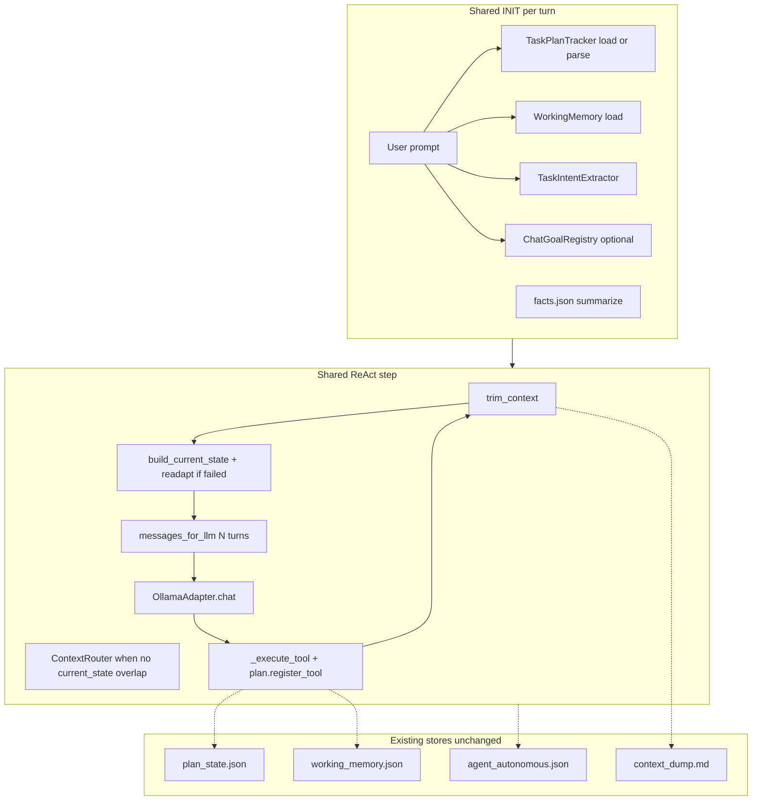
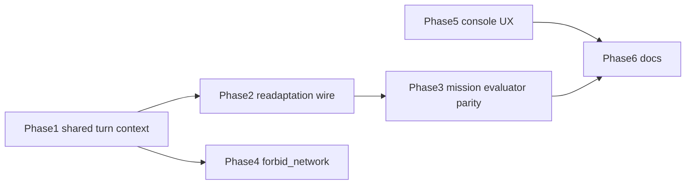

# Agent loop and context unification plan

## Verified gaps (code-backed)

| Gap | Evidence | Impact |
|-----|----------|--------|
| Mission lacks Phase 2 context packet | [`run_mission`](agent.py) calls `adapter.chat(get_messages())` with no `current_state`; [`chat_turn`](agent.py) builds `build_current_state` + `messages_for_llm(history_window_turns)` | Mission burns context on full history; chat has better continuity |
| Plan not initialized on mission | `_task_plan` only set in `chat_turn` (~L1397); `run_mission` never assigns it | Roadmap/`register_tool`/`save_plan_state` ineffective for primary autonomous path |
| Readaptation dead code | [`readaptation_directive()`](core/task_plan.py) defined; zero call sites | Failed PCAP/hash steps get `last_failure` in compact state but not the 5-step recovery playbook |
| `forbid_network` unused | Parsed in [`TaskIntentExtractor`](core/task_intent.py); never read in [`_execute_tool`](agent.py) | User “no recon” requests are prompt-only |
| Console mismatch | Banner says `/help`; REPL uses [`Prompt.ask` choices](console.py) without slash parsing | Operator confusion only |

**Explicitly out of scope** (per your SANDBOX choice + low ROI now):

- Real SANDBOX/HOST tool blocking (badge stays advisory)
- LLM “Planner” phase or “generate 3 alternatives” branch
- Auto-switching `active_specialist` (orthogonal to `ContextRouter` / `ChatGoalRegistry`)
- Embedding-based semantic memory (keep existing Jaccard RAG in [`core/rag.py`](core/rag.py))

---

## Target architecture (what we are finishing, not reinventing)



Mission and chat remain two entry points but share one **turn-prep** path and one **state contract**.

---

## Phase 1 — Shared turn context helper in `agent.py`

**Goal:** One method used by both `run_mission` and `chat_turn` so behavior cannot drift.

Add something like `_build_turn_context(self, *, mission_text: str, draft: str | None = None) -> str`:

- Load or create `self._task_plan` (same logic as chat today: `load_plan_state(session_id) or TaskPlanTracker(mission_text)`)
- Load `self._working_memory` if not already loaded for this turn
- `plan_compact = self._task_plan.compact()` if `self._task_plan.steps` else None
- If `self._task_plan.needs_readaptation()`: append readaptation text (Phase 2 below) into state, not a persisted user message
- Return `build_current_state(mission=..., plan=plan_compact, working_memory=..., last_tool_result=self._last_tool_head, draft=..., facts_block=summarize_facts(...), artifact_refs=self._artifact_refs())`

**Mission loop changes** ([`run_mission`](agent.py) ~L1055–1076):

- At start: init `_task_plan`, `_working_memory`, `_last_tool_head = ""` (mirror chat init)
- Each step before `adapter.chat`:
  - `self.ctx_manager.trim_context()`
  - `current_state = self._build_turn_context(mission_text=user_prompt)`
  - `messages = self.ctx_manager.messages_for_llm(self.history_window_turns)`
  - Pass `current_state=current_state` into `adapter.chat` (already supported on [`OllamaAdapter.chat`](agent.py))

**Chat loop changes:** Replace inline block (~L1439–1456) with call to `_build_turn_context`.

**ContextRouter:** No change required — [`test_current_state_injection_is_single_block`](tests/test_history_window.py) already asserts `session_snippet` / `plan_block` are ignored when `current_state` is set.

---

## Phase 2 — Wire readaptation (fix dead code)

**In [`build_current_state`](core/working_state.py)** (preferred) or in `_build_turn_context`:

- Add optional parameter `readaptation: str = ""`
- When non-empty, insert a high-priority section after `LAST FAILURE`, e.g. `[READAPTATION]` with clipped body (respect existing `MAX_CURRENT_STATE_CHARS` truncation order)

**In `_build_turn_context`:**

```python
readapt = ""
if self._task_plan and self._task_plan.needs_readaptation():
    readapt = self._task_plan.readaptation_directive()
```

Do **not** persist `readaptation_directive` as a user message (same policy as comments at agent.py ~L979–980).

**Tests:**

- Extend [`tests/test_working_state.py`](tests/test_working_state.py): `build_current_state(..., readaptation="...")` includes section and respects budget
- Extend [`tests/test_task_plan.py`](tests/test_task_plan.py): failed write_deliverable triggers `needs_readaptation()` and directive contains `PLAN READAPTATION`

---

## Phase 3 — Mission readaptation and evaluator parity

Today chat does evaluator + `continue` on readapt ([`chat_turn`](agent.py) ~L1537–1557); mission only uses evaluator on **stall** ([`run_mission`](agent.py) ~L1215–1229).

**Minimal alignment:**

- After tools in `run_mission`, if `_task_plan.needs_readaptation()` and `mission_evaluator` is configured and `MissionEvaluator.should_run(user_prompt)`: one evaluator call per mission (cap with a counter like chat’s `evaluator_nudges`), `record_strategy(hint)` + scratchpad — reuse existing pattern from chat
- Do **not** add a separate “evaluate task complete” LLM step; keep `MissionProgressTracker` + `MISSION_COMPLETE` guards

---

## Phase 4 — Enforce `forbid_network` at tool boundary

**In [`_execute_tool`](agent.py)** after `ExecutionPolicy` / before dispatch (or inside a small helper next to [`ExecutionPolicy`](core/execution_policy.py)):

When `self._active_intent.forbid_network` is true and `tool_name` in a fixed frozenset:

`port_scan`, `ping_sweep`, `dns_lookup`, `capture_packets`, `list_network_interfaces`, `http_headers_check`, `ssl_analysis`

Return blocked result with clear error (same shape as `ChatGoalGuard` blocks) — do **not** block `host_exec` / `read_file` / `analyze_pcapng` (user may still inspect local PCAP).

**Tests:** New case in [`tests/test_task_intent.py`](tests/test_task_intent.py) or small `tests/test_forbid_network.py` using a lightweight mock path (block without running Ollama).

---

## Phase 5 — Console UX alignment (low risk)

In [`console.py`](console.py):

- Banner: replace “Use `/help`” with “Type a command: `help`, `mission`, `chat`, …”
- Optional: accept aliases in a thin normalizer before `Prompt.ask` — map `/help` → `help`, `/exit` → `exit` (no full slash parser required)

Update [`show_help`](console.py) table if aliases are added.

---

## Phase 6 — Documentation (accurate diagram)

Add or update a short doc (e.g. [`docs/agent-loop.md`](docs/agent-loop.md) or section in existing architecture doc):

- Mermaid matching **implemented** flow (heuristic plan, not LLM planner)
- Table of on-disk stores (`plan_state.json`, `working_memory.json`, `facts.json`, `context_dump.md`, `agent_*.json`)
- Note deferred: SANDBOX enforcement, specialist auto-routing, three-alternative recovery

Keeps your diagram work honest for future contributors.

---

## Testing and regression checklist

Run existing suites called out in [`state/AGENTS.md`](state/AGENTS.md) task closure, at minimum:

- `tests/test_history_window.py`
- `tests/test_working_state.py`
- `tests/test_task_plan.py`
- `tests/test_context_trim.py`
- `tests/test_completion_guards.py` / `tests/test_mission_progress.py`

Add focused unit tests above; avoid expanding [`tests/test_mission.py`](tests/test_mission.py) (integration script, not pytest).

Manual smoke (optional): one PCAP/hash mission via console `mission` — confirm `plan_state.json` updates and CURRENT STATE shows `READAPTATION` after a forced placeholder `pwd.txt` block.

---

## Implementation order



Phases 1–2 deliver the bulk of architectural value; 4–6 are small and can land in the same PR or follow-ups.

---

## Risk notes

- **History window on mission:** May hide very old tool errors from the model; mitigated by CURRENT STATE + facts + digest in trimmed history. If a mission regresses, temporarily set `history_window_turns: 0` in [`config.yaml`](config.yaml) for A/B.
- **Readaptation size:** `readaptation_directive()` includes full `status_block()` — must clip inside `build_current_state` budget (already truncates by section priority).
- **No behavior change to SANDBOX:** External recon still runs; document in console `toggle` help text if needed (“advisory badge only”).
