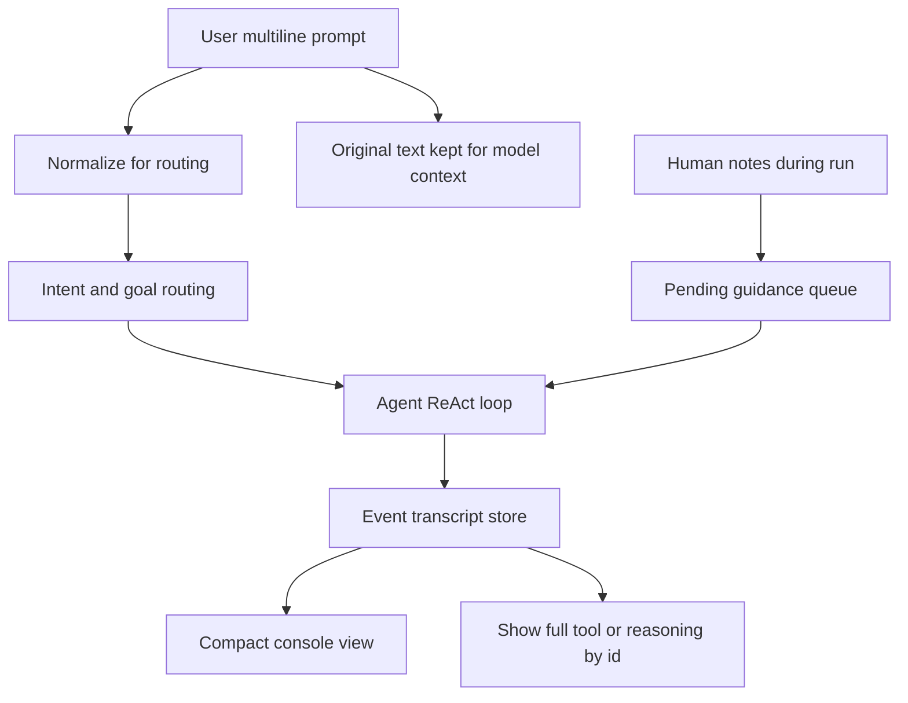

# UX and Workflow Polish Plan

## Goal

Stabilize the next development phase around two tracks:

- **Correctness polish:** remove the remaining false positives/false blocks in the credential workflow now that the main chain works.
- **Operator experience:** make the console easier to drive during long ReAct runs, especially around multiline input, tool visibility, and mid-run guidance.

## Current Anchors

- Input and rendering live in [`c:\Users\soyko\Documents\pwsh_agent\console.py`](c:\Users\soyko\Documents\pwsh_agent\console.py): `prompt_async(..., multiline=True)` currently preserves internal newlines and indentation, and tool output is truncated inline.
- Salt/hash hint parsing lives in [`c:\Users\soyko\Documents\pwsh_agent\core\tool_hints.py`](c:\Users\soyko\Documents\pwsh_agent\core\tool_hints.py): the fallback `salt\s+([a-z0-9._-]{4,})` can misread connector words like `with`.
- Goal completion and write gating live in [`c:\Users\soyko\Documents\pwsh_agent\agent.py`](c:\Users\soyko\Documents\pwsh_agent\agent.py): terminal `crack_hash` outcomes and structured deliverable writes need to remain consistent.
- Hash/salt pairing and final output formatting live in [`c:\Users\soyko\Documents\pwsh_agent\core\credential_extract.py`](c:\Users\soyko\Documents\pwsh_agent\core\credential_extract.py): this should remain the source of truth for `hash=`, `salt=`, `username=`, and `plaintext=` output.

## Proposed Flow

## Implementation Plan

1. **Fix remaining workflow correctness bugs first**

   - Harden [`core\tool_hints.py`](c:\Users\soyko\Documents\pwsh_agent\core\tool_hints.py) so natural language like `use both the hash and its salt with hashpro` never becomes `salt='with'`.
   - Treat connector words and vague references (`with`, `from`, `before`, `after`, `their`, `respective`, `hashpro`) as invalid salt captures unless quoted, numeric, hex-like, or explicitly marked.
   - Ensure [`agent.py`](c:\Users\soyko\Documents\pwsh_agent\agent.py) treats terminal `crack_hash` results (`cracked` and `exhausted`) as enough to allow the final write.
   - Ensure the final write always uses [`core\credential_extract.py`](c:\Users\soyko\Documents\pwsh_agent\core\credential_extract.py) formatting, not a raw password-only fallback.

2. **Normalize multiline input without losing the original prompt**

   - Add a small input-normalization helper used before routing and hint parsing.
   - Preserve the raw user prompt for LLM context and logs.
   - Use the normalized form only for intent extraction, deliverable detection, hash/salt hints, and workflow matching.
   - Normalize indentation, collapse repeated whitespace, and repair obvious terminal-wrapped word splits like `b\nefore` where safe.

3. **Improve submit behavior in [`console.py`](c:\Users\soyko\Documents\pwsh_agent\console.py)**

   - Add `prompt_toolkit` key bindings so `Enter` inserts a newline and `Ctrl+Enter` submits when the terminal supports it.
   - Keep `Esc+Enter` as a fallback and update the prompt copy to show both.
   - If Windows terminal support is inconsistent, expose this as a config/default and fail gracefully to current behavior.

4. **Add compact/full event visibility**

   - Assign stable per-turn IDs to `AGENT_THOUGHT`, `AGENT_TEXT`, `AGENT_TOOL_CALL`, and `AGENT_TOOL_RESULT` in `console.py`.
   - Keep the current compact summaries by default.
   - Store full event payloads in memory for the active turn and optionally mirror them to the session workspace.
   - Add commands such as `/show tool#7`, `/show reasoning#3`, `/verbose on`, `/compact on`, and `/transcript latest`.
   - Avoid a full Textual/dropdown UI for now; use terminal-native folded panels plus explicit show commands.

5. **Allow human guidance during long runs**

   - Add a lightweight guidance queue, not an interrupt.
   - Support commands like `/note try xml filter`, `/set mask=NNNNNNAA!`, `/pause-after-step`, and `/cancel` while an agent turn is active.
   - Inject queued notes after the current tool/subtask completes so the run is not cut mid-action.
   - Surface queued guidance in the next `CURRENT STATE` block or as a system nudge.

6. **Let the agent ask for help when confused**

   - Add explicit pause/clarification triggers for repeated blocked tools, empty critical args, missing salts after extraction, conflicting salt candidates, and repeated exhausted cracks.
   - Render these as operator questions instead of hidden nudges.
   - Example: `I found 3 hashes but no salts. Try XML filter, previous packet lookup, or provide a salt manually?`

7. **Validation**

   - Add focused unit tests for input normalization, salt hint parsing, terminal crack result gating, and structured deliverable formatting.
   - Add a small console event-rendering test around compact IDs and `/show` lookup.
   - Re-run the PCAP credential task as an end-to-end manual check: it should find salts, attempt cracks, and write the structured `pwd_*.txt` even when some hashes are exhausted.

## Non-Goals For This Phase

- Do not migrate to a full Textual/Rich TUI yet.
- Do not fully refactor to workflow profiles in this phase.
- Do not remove deterministic fallbacks yet; first make them less intrusive and better isolated.

## Expected Outcome

The agent keeps the current successful PCAP credential behavior, avoids the known `salt='with'` and stale write-guard failures, preserves structured deliverables, and gives the operator better control over long-running turns without forcing cancellation or hiding important tool details.