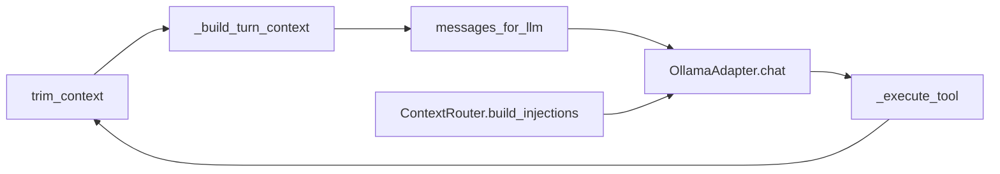
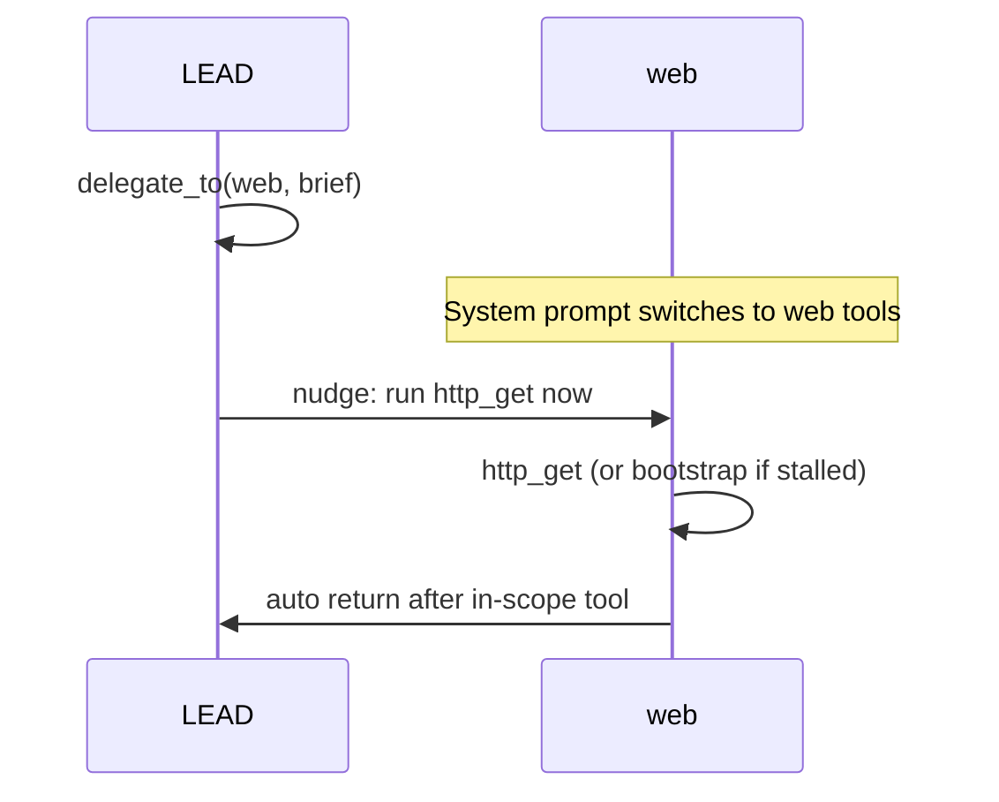

# Agent loop architecture

Pulse uses two ReAct entry points that share one tool path and (after unification) one turn-prep contract.

## Entry points

| Entry | Module | Steps | Completion |
|-------|--------|-------|------------|
| Mission | `agent.run_mission` | `config.agent.max_steps` (default 30) | `MISSION_COMPLETE` + progress tracker + synthesis |
| Chat | `agent.chat_turn` | 12 (fixed) | `ChatGoals.may_end_turn` + `TaskPlanTracker.may_complete_turn` |
| MCP | `mcp_server.py` | N/A | Direct tool calls, no ReAct loop |

Console (`console.py`) drives mission and chat via the REPL.

## Per-step flow (shared)

1. **`trim_context`** — Collapse stale nudges, digest old tool results, drop oldest turns, token/char caps, turn-aware artifact caps on heavy tools in older turns.
2. **`_build_turn_context`** — `build_current_state()` from mission text, plan compact, working memory, facts, artifacts, and optional readaptation playbook (not persisted).
3. **`messages_for_llm(N)`** — Pinned system + anchor user + last N assistant/tool turns; full log stays on disk.
4. **`OllamaAdapter.chat`** — Appends transient injections (CURRENT STATE, matched tool schemas in pack mode) then calls Ollama with `num_ctx` from config.

## Prompt pack mode (`config.agent.prompt_pack_mode`)

When enabled (default in `config.yaml`):

| File | Injected as | Notes |
|------|-------------|-------|
| `state/AGENTS.md` | System: AGENTS | Specialist roster, handoff rules |
| `state/SOUL.md` | System: SOUL | Operator principles |
| Per-agent tools | System: TOOLS + Ollama `tools=` | From `core/tool_schemas.py` (full roster, no truncation gaps) |
| Live state | System: CURRENT STATE | Built each turn — **not** read from `CURRENT_STATE.md` |

Legacy mode still injects phase hints, domain RAG, and tool playbooks via `ContextRouter`.

## Specialist handoff (prompt pack)

- **LEAD only:** `delegate_to`, `append_note`, findings/report tools.
- **Specialists:** one in-scope action per handoff; `append_note` / `delegate_to` hard-blocked.
- **Orphan reset:** if turn ends without handoff completion, `active_agent` returns to `lead`.
- **Console badge:** `(LEAD)` / `(WEB)` reflects in-memory `active_specialist`.

See [specialist_handoff_plan.md](plans/specialist_handoff_plan.md).

## On-disk stores (per session)

All state for active sessions is consolidated into a single SQLite database file. Legacy JSON files are auto-migrated on first access and renamed to `*.json.bak`.

| File | Purpose |
|------|---------|
| `state/sessions/<id>/session.db` | Consolidated SQLite database containing the messages history and all session key-value states (facts, plan_state, working_memory, intent_spec, handoff, and audit current_state_md). |
| `CURRENT_STATE.md` | **Audit/replay snapshot only** — written to disk for human operator inspection, but also persisted inside `session.db`. |
| `context_dump.md` | Full text of digested old tool results. |
| `llm_audit.jsonl` | Optional full prompt/response audit. |
| `artifacts/*` | Spilled tool outputs (e.g. large `http_get`). |
| `*.bak` | Backup files of migrated legacy JSON session states. |

## Console session commands

| Command | Effect |
|---------|--------|
| `new` | New session id; seal prior handoff; reset specialist to LEAD |
| `session list` | Active id + sealed handoff table |
| `session pick <id>` | Inject prior handoff summary into CURRENT STATE |
| `session clear` | Drop pick + reset specialist to LEAD (active session unchanged) |

## Guards (tool boundary)

- `WriteGuard`, `ExecutionPolicy`, `ChatGoalGuard`
- `LEAD_ONLY_TOOLS` hard block for specialists (`core/specialists.py`)
- `forbid_network` on `TaskIntent` blocks recon/network tools when the user requests it
- SANDBOX/HOST badge is **advisory** only (no hard isolation)

## Context budget

`config.yaml` aligns `max_context_tokens` (8192) with `ollama.num_ctx`. Reserves:

- `reserve_generation_tokens` — reply headroom
- `reserve_injection_tokens` — CURRENT STATE + schemas (~`injection_budget_chars`)

## Deferred (not in this stack)

- Web auth HTML/XML parse pipeline — [web_auth_html_pipeline_plan.md](plans/web_auth_html_pipeline_plan.md)
- LLM planner / three-alternative recovery
- Auto `active_specialist` routing (manual `delegate_to` only)
- Embedding-based semantic memory (Jaccard RAG remains)
- `IntentSpec` hard-gating (`intent.shadow_mode` is advisory)
- Real SANDBOX tool blocking

## Audit hygiene

- `core/` does not import `agent.py`, `console.py`, or `mcp_server.py`
- Tools export via `tools/__all__`; `ReActAgent` loads the registry from there
- Session outputs go under `state/sessions/` via `core/session_paths.py`

## Session closure (2026-06-04)

See [session_closure_20260604.md](plans/session_closure_20260604.md).
