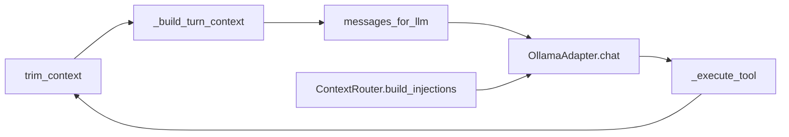

# Agent loop architecture

Pulse uses two ReAct entry points that share one tool path and (after unification) one turn-prep contract.

## Entry points

| Entry | Module | Steps | Completion |
|-------|--------|-------|------------|
| Mission | `agent.run_mission` | `config.agent.max_steps` (default 30) | `MISSION_COMPLETE` + progress tracker + synthesis |
| Chat | `agent.chat_turn` | 12 (fixed) | `ChatGoals.may_end_turn` + `TaskPlanTracker.may_complete_turn` |
| MCP | `mcp_server.py` | N/A | Direct tool calls, no ReAct loop |

Console (`console.py`) drives mission and chat via the REPL.

## Per-step flow (shared)

1. **`trim_context`** — Collapse stale nudges, digest old tool results, drop oldest turns, token/char caps, turn-aware artifact caps on heavy tools in older turns.
2. **`_build_turn_context`** — `build_current_state` from mission text, plan compact, working memory, facts, artifacts, and optional readaptation playbook (not persisted).
3. **`messages_for_llm(N)`** — Pinned system + anchor user + last N assistant/tool turns; full log stays on disk.
4. **`OllamaAdapter.chat`** — Appends transient injections (CURRENT STATE, phase hints, RAG playbooks, matched tool schemas) then calls Ollama with `num_ctx` from config.

## On-disk stores (per session)

| File | Purpose |
|------|---------|
| `state/sessions/<id>/agent_autonomous.json` | Full ReAct message history |
| `plan_state.json` | Heuristic roadmap (`TaskPlanTracker`) |
| `working_memory.json` | Volatile scratch fields |
| `facts.json` | Structured session facts |
| `context_dump.md` | Full text of digested old tool results |
| `llm_audit.jsonl` | Optional full prompt/response audit |

## Guards (tool boundary)

- `WriteGuard`, `ExecutionPolicy`, `ChatGoalGuard`
- `forbid_network` on `TaskIntent` blocks recon/network tools when the user requests it
- SANDBOX/HOST badge is **advisory** only (no hard isolation)

## Context budget

`config.yaml` aligns `max_context_tokens` (8192) with `ollama.num_ctx`. Reserves:

- `reserve_generation_tokens` — reply headroom
- `reserve_injection_tokens` — CURRENT STATE + RAG + schemas (~`injection_budget_chars`)

## Deferred (not in this stack)

- LLM planner / three-alternative recovery
- Auto `active_specialist` routing
- Embedding-based semantic memory (Jaccard RAG remains)
- `IntentSpec` hard-gating (`intent.shadow_mode` is advisory)
- Real SANDBOX tool blocking

## Audit hygiene

- `core/` does not import `agent.py`, `console.py`, or `mcp_server.py`
- Tools export via `tools/__all__`; `ReActAgent` loads the registry from there
- Session outputs go under `state/sessions/` via `core/session_paths.py`
