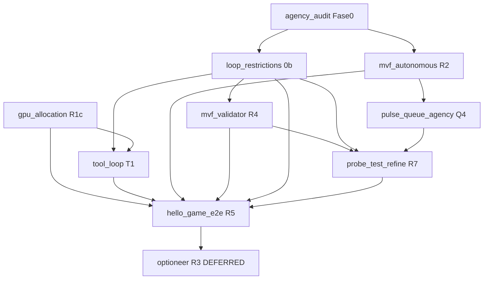

# MVF + Agencia — Roadmap maestro (sincronizado)

> **Versión:** 2026-06-19  
> **Status:** ACTIVE — documentación unificada  
> **Canon:** [AGENT_CANON.md](../AGENT_CANON.md) · [ORCHESTRATOR_CANON.md](../ORCHESTRATOR_CANON.md)  
> **Sesión diseño:** [reference/DESIGN_SESSION_2026-06-19.md](../reference/DESIGN_SESSION_2026-06-19.md)

Documento **único de coordinación** para los planes hijos en `docs/plans/`. Todos los planes MVF referencian este archivo. No duplicar orden de ejecución en otros sitios — enlazar aquí.

---

## 1. Mapa de planes

| ID | Plan | Fase | Prioridad | Status | Depende de |
|----|------|------|-----------|--------|------------|
| **0** | [agency_audit_plan.md](./agency_audit_plan.md) | Baseline | P0 | ACTIVE | — |
| **0b** | [loop_restrictions_review.md](./loop_restrictions_review.md) | Revisión guards | P0 | PROPOSED | 0 |
| **R2** | [mvf_autonomous_plan.md](./mvf_autonomous_plan.md) | Checkpoints | P0 | IMPLEMENTED | 0 |
| **R4** | [mvf_validator_plan.md](./mvf_validator_plan.md) | MVF CPU | P1 | IMPLEMENTED (R4b) | 0b |
| **R7** | [probe_test_refine_plan.md](./probe_test_refine_plan.md) | Refine loop | P1 | PROPOSED | R4, 0b |
| **Q4** | [pulse_queue_agency_plan.md](./pulse_queue_agency_plan.md) | Cola mutável | P1 | PROPOSED | R2 |
| **R5** | [hello_game_e2e_plan.md](./hello_game_e2e_plan.md) | Demo E2E | P2 | PROPOSED | R2, R4, 0b; R7 recom. |
| **R1c** | [gpu_allocation_plan.md](./gpu_allocation_plan.md) | Infra GPU | P1 | PROPOSED | — |
| **T1** | [tool_loop_plan.md](./tool_loop_plan.md) | Tooling EXECUTE | P1 | PROPOSED | 0b; R1c recom. |
| **R3** | [OptionsPack/optioneer_draft.md](./OptionsPack/optioneer_draft.md) | Optioneer | — | DEFERRED | R5 |

**Leyenda IDs:** R* = roadmap [AGENT_CANON.md](../AGENT_CANON.md) §15 · Q4 = fase cola (no canon R#)

---

## 2. Orden de ejecución (obligatorio)

```text
0   agency_audit_plan          → baseline + harness (puede overlap con código)
0b  loop_restrictions_review   → inventario guards; ver también tool_loop_plan T1
0a  gpu_allocation_plan        → R1c swap 1070 (recom. antes de R5)
0c  tool_loop_plan             → T1 audit parser + ST (paralelo R4)
1   mvf_autonomous_plan        → R2 — desbloquea daemon/cola nocturna
2   mvf_validator_plan         → R4 — gate MISSION_COMPLETE + mvf.json
2b  R4b (mvf_validator_plan)   → gate en TODAS rutas salida + dir_count + delivery_probe
3   loop_restrictions_review   → IMPLEMENTAR relajaciones (§B,D,E,F) + T1-A/D
4   probe_test_refine_plan     → R7 — cierre loop R+P+A+V+I
5   pulse_queue_agency_plan    → Q4 — notas, update_job, hygiene→work_queue
6   hello_game_e2e_plan        → R5 — night_mission.py + assert MVF (tras R1c verify)
—   OptionsPack/               → R3 — solo tras R5 verde
```

**Reglas de compatibilidad:**

| Regla | Motivo |
|-------|--------|
| No implementar §B (MIN_TOOLS) sin R4 | Evitar `MISSION_COMPLETE` sin gate |
| R7 puede iniciar sin Q4 | `append_job_note` es opcional v1 |
| Q4 puede iniciar tras R2 | `_active_queue_job_id` definido en R2 |
| R5 requiere R2 + R4 mínimo | Daemon + MVF verificable |
| R5 recomienda R1c (swap GPU) | EXECUTE en GPU antes idle |
| T1-C tool_agent tras R1c | Mismo slot coder, no 4ª GPU |
| T1-B parser sin audit T-G1 | Riesgo de cambio prematuro |
| R3 no bloquea R5 | PLAN actual suficiente para HelloGame |

---

## 3. Grafo de dependencias



---

## 3.1 Decisiones pendientes e investigación abierta

Resumen ejecutivo; detalle completo en planes hijos.

### Infra GPU ([gpu_allocation_plan.md](./gpu_allocation_plan.md))

| Decisión | Recomendación | Estado |
|----------|---------------|--------|
| **A** — Swap 1070 (INTAKE :11435, EXECUTE :11436) | **Aprobar** — bajo riesgo, alto impacto | ☐ Pendiente operador |
| **B** — INTAKE en vibethinker 3B (libera 1070) | Investigar G1 antes | ☐ |
| **C** — Modelfile `tool_agent` en slot EXECUTE | Tras A + audit T-G1/G5 | ☐ |
| **D** — Llama vs Qwen coder | Benchmark; no bloquea A | ☐ |
| **E** — Anti-patrones (2×7B/GPU, unload) | **No hacer** | ✓ |

| Investigación | Pregunta clave |
|---------------|----------------|
| G1 | ¿IntentSpec 3B ≈ chat-analyzer? |
| G2 | ¿p95 EXECUTE mejora post-swap? |
| G3 | ¿`num_ctx_intake` separado en dispatch? |
| G4 | ¿hygiene en 1070 idle sin contention? |
| G5–G6 | ¿tool_agent / Llama mejoran tool_calls? |

### Tool loop ([tool_loop_plan.md](./tool_loop_plan.md))

| Decisión | Recomendación | Estado |
|----------|---------------|--------|
| **T1-A** — Menos ST en EXECUTE; PLAN estrategia | **Default** para code_build | ☐ |
| **T1-B** — Parser ST + acción mismo turno | Tras T-G4 positivo | ☐ |
| **T1-C** — tool_agent Modelfile | Ligado a R1c Decisión C | ☐ |
| **T1-D** — "one substantive action" | Con T1-B o solo prompt | ☐ |
| **T1-E** — LEAD `append_note` + `delegate_to` | Independiente, bajo riesgo | ☐ |
| **T1-F** — Concurrencia tools | **Diferido** → R9 | — |
| **T1-G** — ST ≠ sustituto PLAN | **No hacer** | ✓ |

| Investigación | Pregunta clave |
|---------------|----------------|
| T-G1 | ¿Parser descarta tool_calls nativos? |
| T-G2 | ¿% turns EXECUTE solo-ST? |
| T-G3 | ¿`read_file` es sustantiva en code_build? |
| T-G4 | ¿ST+action mejora MVF o solo tokens? |

**Orden sugerido de resolución:** G2/T-G1 (audit baseline) → Decisión A → T1-A → R2/R4 → T1-B/D si T-G4 → Decisión C.

---

## 4. Contratos compartidos (cross-compatibility)

Todos los planes deben usar **los mismos nombres y paths**. No inventar variantes por plan.

### 4.1 HelloGame — paths canónicos

| Artefacto | Path correcto | Anti-patrón observado |
|-----------|---------------|------------------------|
| Plan | `HelloGame/PLAN.md` | `hello_game/` (minúsculas) |
| Juego | `HelloGame/game.py` | `hello_game/greet.js` (JS) |
| Test | `HelloGame/tests/test_game.py` | sin tests |

**Misión canónica** (plantilla `hello_game.yaml`), no texto libre del wizard:

```text
In HelloGame/ create PLAN.md and game.py — a minimal Python ASCII game.
Add tests/test_game.py with a smoke import test. Run pytest until green.
```

**Encolado correcto:**

- `console.py` → `queue` → `template` → `hello_game`
- `enqueue_from_template("hello_game")`
- **No** usar wizard `add` con texto `"hello_game template"` (provoca misinterpretación LLM)

### 4.2 MVF schema (`mvf.json`)

Único schema en [mvf_validator_plan.md](./mvf_validator_plan.md). R7 y R5 referencian el mismo `validated` flag.

### 4.3 Perfiles checkpoint

| Contexto | Perfil |
|----------|--------|
| Consola `pulse` interactiva | `interactive` o `headless` (config global) |
| Jobs cola / daemon / nocturno | `mvf_autonomous` (columna `checkpoint_profile`) |
| Post-MVF promote | `PROMOTE_GATE` (notify; silencio no revierte) |

### 4.4 Multi-GPU Ollama

**Estado actual (pre-R1c):**

| Fase | Puerto | Modelo | GPU |
|------|--------|--------|-----|
| INTAKE | :11436 | chat-analyzer | 1070 #2 (idle en EXECUTE) |
| PLAN, EVALUATE | :11434 | vibethinker:3b | 1080 |
| VALIDATE, EXECUTE | :11435 | qwen-coder 7B | 1070 #1 (saturada) |

**Objetivo post [gpu_allocation_plan.md](./gpu_allocation_plan.md) Decisión A:**

| Fase | Puerto | Modelo |
|------|--------|--------|
| INTAKE | :11435 | chat-analyzer |
| PLAN, EVALUATE | :11434 | vibethinker:3b |
| VALIDATE, EXECUTE | :11436 | qwen-coder / tool_agent |

Implementación: [`core/model_dispatch.py`](../../core/model_dispatch.py). Banner `pulse` solo muestra coder — verificar vía audit (`host` + `turn_phase`).

**Política:** `unload_after_call: false` — un modelo pinneado por GPU; ver [gpu_allocation_plan.md](./gpu_allocation_plan.md).

### 4.5 Bucle herramientas EXECUTE

- Parser: 1 acción + N `append_note` por turno — [tool_loop_plan.md](./tool_loop_plan.md)
- `sequentialthinking` ≠ PLAN monologue; preferir PLAN para code_build (T1-A)
- Modelfile `tool_agent` no sustituye cambios parser

### 4.6 Specialist code_build

| Rol | Cuándo |
|-----|--------|
| `lead` | Planifica, `delegate_to(workspace)` |
| `workspace` | Escribe código; **no** puede `delegate_to` |

Plantilla `hello_game.yaml` usa `specialist: workspace` — misión debe ejecutar tools directamente o arrancar con LEAD + delegate. Documentado en [loop_restrictions_review.md](./loop_restrictions_review.md) y [hello_game_e2e_plan.md](./hello_game_e2e_plan.md).

### 4.7 Cola dual (hasta Q4)

| Sistema | DB | Migración |
|---------|-----|-----------|
| Pulse Queue | `.pulse/work_queue.db` | Target |
| Legacy scheduler | `.pulse/scheduler.db` | Bridge en Q4 |
| Hygiene feed | → scheduler hoy | → work_queue en Q4 |

---

## 5. Runbook operativo (lecciones sesión 2026-06-19)

Errores reales observados; incluir en baseline [agency_audit_plan.md](./agency_audit_plan.md).

### 5.1 Entorno

```powershell
.venv\Scripts\activate          # croniter y deps
py -3.10 pulse_queue.py ...     # preferir py -3.10 explícito
```

Sin venv: `ModuleNotFoundError: croniter` al encolar.

### 5.2 Un solo agente / sesión SQLite

**Síntoma:**

```text
Could not clear SQLite history: [WinError 32] ... session.db ... otro proceso
Could not save agent state to SQLite: Cannot operate on a closed database.
```

**Causa:** `pulse` (console) + `pulse_queue.py daemon` comparten `state/active_session.json`; `new_session()` en orquestador intenta borrar DB bloqueada.

**Mitigación hasta fix de código (Q4/R2):**

- No correr `pulse` y daemon simultáneamente
- O usar `console.py` → `new` antes de daemon
- Fix planificado: sesión aislada por job en [mvf_autonomous_plan.md](./mvf_autonomous_plan.md) + no unlink DB si lock (graceful)

### 5.3 Verificación multi-GPU

```powershell
py -3.10 tools_dev\vertical_smoke.py
curl http://localhost:11436/api/tags
curl http://localhost:11434/api/tags
curl http://localhost:11435/api/tags
```

### 5.4 Daemon + HelloGame

```powershell
# Encolar plantilla (desde Python REPL o console queue template)
py -3.10 pulse_queue.py run-once   # force bypass idle
# Tras R5:
py -3.10 tools_dev\night_mission.py --template hello_game --force --assert-mvf
```

---

## 6. Bucle agencia objetivo (R+P+A+V+I)

Estado **target** tras R5 + R7 + Q4:

```text
Cola (work_queue)
  → orchestrator (idle/noche, mvf_autonomous)
    → INTAKE :11436 → PLAN :11434 → VALIDATE roadmap :11435
    → EXECUTE :11435 (loop)
    → MVF CPU validate (R4)
    → [fail] EVALUATE :11434 + refine (R7)
    → [pass] MISSION_COMPLETE → mvf.json validated
    → append_job_note / done (Q4)
    → operator_inbox notify (R2)
```

Checklist medible: [agency_audit_plan.md](./agency_audit_plan.md) § R+P+A+V+I.

---

## 7. Matriz implementación vs canon R1–R9

| Canon | Entregable | Plan | Status |
|-------|------------|------|--------|
| R1 | AGENT_CANON.md | — | DONE |
| R1b | Pulse Queue | ORCHESTRATOR_CANON | DONE (parcial) |
| R2 | mvf_autonomous | mvf_autonomous_plan | PROPOSED |
| R3 | Optioneer | OptionsPack/ | DEFERRED |
| R4 | mvf.json + validator | mvf_validator_plan | PROPOSED |
| R5 | HelloGame E2E | hello_game_e2e_plan | PROPOSED |
| R6 | pipelines YAML | post-R5 | NOT STARTED |
| R7 | probe/test/refine | probe_test_refine_plan | PROPOSED |
| R8 | experience store | — | OUT OF SCOPE |
| R9 | GPU paralelo | — | OUT OF SCOPE |

---

## 8. Baseline registrado (2026-06-19)

Corrida parcial daemon + wizard manual (no plantilla). Ver [agency_audit_plan.md](./agency_audit_plan.md) § Baseline runs.

| Ítem | Resultado |
|------|-----------|
| Cola encola job | OK (`3e6887bcaf89`) |
| Daemon ejecuta misión | OK (parcial) |
| SQLite session | FAIL (WinError 32) |
| Deliverables HelloGame | FAIL (`hello_game/greet.js` vs `HelloGame/game.py`) |
| MVF validated | N/A (R4 pendiente) |
| 3 puertos Ollama | Config OK; audit no verificado en esta corrida |
| checkpoint_profile | No aplicado (R2 pendiente) |

---

## 9. Índice rápido de planes hijos

| Enlace | Una línea |
|--------|-----------|
| [agency_audit_plan.md](./agency_audit_plan.md) | Harness + checklist R+P+A+V+I |
| [loop_restrictions_review.md](./loop_restrictions_review.md) | Guards vs MVF-first |
| [mvf_autonomous_plan.md](./mvf_autonomous_plan.md) | Checkpoints notify-only + orchestrator wire |
| [mvf_validator_plan.md](./mvf_validator_plan.md) | mvf.json + CPU checks |
| [probe_test_refine_plan.md](./probe_test_refine_plan.md) | Loop tras fallo MVF |
| [pulse_queue_agency_plan.md](./pulse_queue_agency_plan.md) | update_job, notas, hygiene migrate |
| [hello_game_e2e_plan.md](./hello_game_e2e_plan.md) | night_mission.py demo |
| [gpu_allocation_plan.md](./gpu_allocation_plan.md) | Swap GPU, tool_agent slot |
| [tool_loop_plan.md](./tool_loop_plan.md) | Parser, ST, concurrencia EXECUTE |
| [OptionsPack/README.md](./OptionsPack/README.md) | R3 diferido |

---

*Actualizar este documento cuando un plan pase a DONE o cambien contratos compartidos.*
