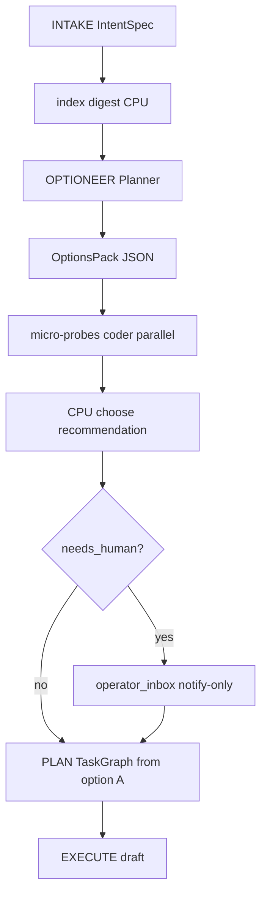

# Borrador: Optioneer y OptionsPack (R3)

> **Status:** DEFERRED — solo planificación  
> **Roadmap maestro:** [../MVF_AGENCY_ROADMAP.md](../MVF_AGENCY_ROADMAP.md)  
> **Canon:** [AGENT_CANON.md](../../AGENT_CANON.md) §5  
> **No bloquea:** [hello_game_e2e_plan.md](../hello_game_e2e_plan.md)

---

## Resumen

**Optioneer ≠ PLAN.** El planner actual (`IntentPlanner.decompose`) genera pasos de roadmap. Optioneer debe generar un **`OptionsPack`**: 2–3 estrategias alternativas (A/B/C) con pros/cons, sketch de sintaxis, y tests-first sugeridos — **antes** de que el coder escriba código caro.

Inspiración: fase `optioneer` del pipeline vertical en `exploration-kernel/protocols/vertical_pipeline.md`.

---

## Problema que resuelve

| Sin Optioneer | Con Optioneer |
|---------------|---------------|
| PLAN commit a una descomposición | Explora estrategias en paralelo (barato) |
| Fallo de enfoque → replan tardío | Micro-probe descarta opciones inviables antes de draft |
| Coder recibe roadmap rígido | Coder recibe **una** opción elegida + tests-first |

---

## Contrato `OptionsPack`

Schema JSON (canon §5):

```json
{
  "problem_frame": "Minimal ASCII game in HelloGame/ for MVF demo",
  "unknowns": ["input method", "rendering: ANSI vs plain print"],
  "options": [
    {
      "id": "A",
      "strategy": "stdin line loop — read command, update state, print board",
      "pros": ["minimal deps", "easy pytest with io.StringIO"],
      "cons": ["no real-time input"],
      "syntax_sketch": "while True: cmd = input(); ...",
      "tests_first": ["test game module imports", "test one move updates state"],
      "confidence": 0.85
    },
    {
      "id": "B",
      "strategy": "ANSI grid in terminal with keyboard module",
      "pros": ["nicer UX"],
      "cons": ["extra dep", "Windows terminal variance"],
      "syntax_sketch": "import curses ...",
      "tests_first": ["mock curses"],
      "confidence": 0.55
    }
  ],
  "recommendation": "A",
  "needs_human": false
}
```

### Campos obligatorios v1

- `problem_frame`, `options[]` (≥2), `recommendation`, `needs_human`

### Validación

- JSON schema en `exploration-kernel/schemas/` (crear `options_pack.schema.json` cuando se implemente)
- Planner serializa; CPU valida schema antes de probes

---

## Flujo propuesto



### Pasos detallados

1. **Input:** `IntentSpec` compact (~500 tok) + index digest (lista archivos workspace, no prosa)
2. **Planner** (`TurnPhase.PLAN` o fase nueva `OPTIONEER`): razona internamente, emite `OptionsPack`
3. **Micro-probes:** por cada option, coder genera ≤10 líneas (import test, syntax check) — paralelo si R9 GPU
4. **CPU elige** `recommendation` si probes OK y `!needs_human`
5. **Notify:** si `needs_human` → append `operator_inbox.jsonl`; **no bloquear** (mvf_autonomous)
6. **PLAN:** `decompose` recibe solo la opción elegida + `tests_first`
7. **EXECUTE:** roadmap acotado a estrategia A

---

## Módulo futuro: `core/optioneer.py`

```python
class Optioneer:
    def __init__(self, planner_url, model, num_ctx, agent_config): ...

    async def generate(self, spec: IntentSpec, index_digest: dict) -> OptionsPack: ...

    async def run_probes(self, pack: OptionsPack) -> dict[str, ProbeResult]: ...

    def choose(self, pack: OptionsPack, probe_results: dict) -> str:
        """Return option id; respects needs_human with notify-only."""
```

### Integración en `agent.py`

Insertar **entre** `_compute_intent_spec` y `_run_vt_planning`:

```python
await self._compute_intent_spec(user_prompt)
if self.config.get("optioneer", {}).get("enabled", False):
    await self._run_optioneer(user_prompt)
await self._run_vt_planning(user_prompt)
```

Default `enabled: false` hasta R3 complete.

---

## Ejemplo HelloGame (hipotético)

| Option | Estrategia | Probe | Resultado |
|--------|------------|-------|-----------|
| A | stdin loop | `import game` syntax OK | ✅ |
| B | curses | import fail Windows CI | ❌ |
| **Elegido** | **A** | | |

PLAN genera steps: write PLAN.md → write game.py (loop A) → write test_game.py → pytest.

**Nota:** Con PLAN actual sin Optioneer, el agente puede igualmente completar HelloGame — Optioneer mejora **calidad de estrategia**, no viabilidad MVF mínima.

---

## Config propuesta

```yaml
optioneer:
  enabled: false
  min_options: 2
  max_options: 3
  probe_max_lines: 10
  notify_on_needs_human: true
```

---

## Dependencias

| Componente | Plan relacionado |
|------------|------------------|
| MVF / goal lock | [mvf_validator_plan.md](../mvf_validator_plan.md) |
| Notify-only human | [mvf_autonomous_plan.md](../mvf_autonomous_plan.md) |
| Index digest | AGENT_CANON §4 `index` — parcial hoy |
| Parallel probes | R9 GPU — opcional v1 secuencial |

---

## Tests planificados (futuro)

| Test | Descripción |
|------|-------------|
| `test_options_pack_schema` | JSON válido |
| `test_optioneer_choose_after_probe` | B descartada |
| `test_needs_human_notify_only` | inbox line, no block |
| `@pytest.mark.live` HelloGame con optioneer | A elegida |

---

## Criterios de aceptación (cuando se implemente)

1. OptionsPack persistido en `state/sessions/<id>/options_pack.json`
2. Al menos 2 opciones por misión code_build
3. Micro-probe ejecutado antes de PLAN
4. `needs_human: true` → notify, misión continúa con `recommendation` default
5. HelloGame E2E sigue pasando con `optioneer.enabled: true`

---

## Observaciones

1. **No confundir** con roadmap VALIDATE — Optioneer es pre-plan estratégico.
2. **Coste:** +1 llamada planner por misión; amortizado si evita replan EXECUTE.
3. **Hestia reference:** skills declarativos — alinear con R6 `knowledge/pipelines/*.yaml`.
4. **Retomar R3** solo tras baseline R5 documentado en [agency_audit_plan.md](../agency_audit_plan.md).

---

## Referencias

- [AGENT_CANON.md](../../AGENT_CANON.md) §5
- [DESIGN_SESSION_2026-06-19.md](../../reference/DESIGN_SESSION_2026-06-19.md) — R3 pendiente
- [hello_game_e2e_plan.md](../hello_game_e2e_plan.md)
- `exploration-kernel/protocols/vertical_pipeline.md`
