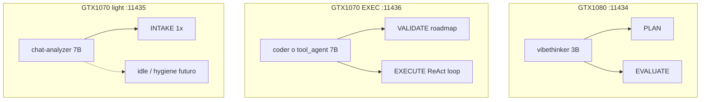

# Plan: Asignación multi-GPU y modelos residentes (R1c)

> **Status:** IMPLEMENTED (R1c v2 — coder en 1080)  
> **Roadmap:** R1c (infra, complementa R1b Pulse Queue)  
> **Prioridad:** P1 — antes o en paralelo con R5 E2E  
> **Roadmap maestro:** [MVF_AGENCY_ROADMAP.md](./MVF_AGENCY_ROADMAP.md)  
> **Canon:** [AGENT_CANON.md](../AGENT_CANON.md) §7 · [knowledge.md](../knowledge.md) §1–2  
> **Relacionado:** [tool_loop_plan.md](./tool_loop_plan.md) (modelo EXECUTE / tool_agent)

---

## Problema

Con el mapeo actual ([`memory/2026-06-19.md`](../../memory/2026-06-19.md)):

| Puerto | GPU | Modelo | Carga real en misión |
|--------|-----|--------|----------------------|
| :11436 | 1070 #2 | chat-analyzer 7B | **INTAKE 1×** → idle durante EXECUTE |
| :11435 | 1070 #1 | qwen-coder 7B | **VALIDATE + EXECUTE (hasta 30×)** → saturada |
| :11434 | 1080 | vibethinker 3B | PLAN + EVALUATE → moderada |

La política `unload_after_call: false` ([`config.yaml`](../../config.yaml)) exige **un modelo pinneado por GPU**. No se puede cargar/descargar entre fases sin romper latencia y estabilidad.

**Síntoma:** una 1070 ociosa con 7B residente mientras la otra 1070 sostiene todo el bucle ReAct.

---

## Principios de diseño

1. **Pin permanente** — sin unload entre fases del pipeline (`keep_alive: 24h`).
2. **Un modelo completo por GPU** — Pascal 8 GB sin NVLink; no dos 7B en la misma GPU (~9 GB+).
3. **Mover trabajo, no acumular modelos** — reasignar roles entre GPUs antes de añadir contenedores.
4. **num_ctx por rol** — INTAKE 8192, EXECUTE/VALIDATE 16384, PLAN 32768 ([VRAM probe 2026-06-19](../../memory/2026-06-19.md)).
5. **Probes sin contention** — no medir VRAM con hygiene + misión + probe simultáneos.

---

## Perfil de carga por fase

```text
t=0     INTAKE ─────────────────► 1 llamada
        PLAN + VALIDATE roadmap ──► 3–8 llamadas
t=1..N  EXECUTE (ReAct) ─────────► N llamadas (dominante)
        EVALUATE (opcional) ─────► 0–N llamadas espaciadas
```

**Conclusión:** EXECUTE debe vivir en la GPU que hoy solo hace INTAKE.

---

## Propuestas de decisión

### Decisión A — **Intercambiar las dos GTX 1070** (recomendada, bajo riesgo)

Intercambiar contenedores / `GPU_DEVICE` y remap en `config.yaml`:

| Rol pipeline | Endpoint ANTES | Endpoint DESPUÉS | Modelo |
|--------------|----------------|-------------------|--------|
| INTAKE | :11436 | **:11435** | chat-analyzer |
| VALIDATE + EXECUTE | :11435 | **:11436** | qwen-coder (o tool_agent) |
| PLAN + EVALUATE | :11434 | :11434 | vibethinker 3B |

```yaml
# config.yaml — propuesta
ollama:
  endpoints:
    intake:  "http://localhost:11435"
    planner: "http://localhost:11434"
    coder:   "http://localhost:11436"
```

**Cambios operativos:**

- `.env`: swap `GPU_DEVICE_INTAKE` ↔ `GPU_DEVICE_CODER` (o equivalente en compose)
- `setup-models.ps1` / pulls en contenedor correcto
- `verify-multi-gpu.ps1` tras swap
- Sin cambios en `core/model_dispatch.py` (lee endpoints de config)

| Criterio | Evaluación |
|----------|------------|
| Esfuerzo | Bajo (config + compose + verify) |
| Riesgo | Bajo |
| Mejora utilización | Alta en misiones largas |
| Nuevo modelo | No |

**Estado:** ☐ Pendiente aprobación operador

---

### Decisión B — **INTAKE ligero en 1080 (vibethinker 3B)**

Secuencia en :11434: INTAKE JSON → PLAN monologue → (misión) → EVALUATE.

| Efecto | Detalle |
|--------|---------|
| Libera | Una 1070 entera (sin chat-analyzer 7B) |
| Uso liberado | hygiene `ai_reviewer`, 2ª rama EXECUTE (R9), reserva |

| Criterio | Evaluación |
|----------|------------|
| Esfuerzo | Medio (prompt IntentSpec en 3B, tests calidad JSON) |
| Riesgo | Medio — IntentSpec degradado vs chat-analyzer |
| Prerequisito | Benchmark INTAKE 3B vs 7B en `tools_dev/` |

**Estado:** ☐ Requiere investigación (ver § Investigación abierta)

---

### Decisión C — **Modelfile `tool_agent` en GPU EXECUTE**

No es cuarta GPU: reemplaza o complementa `qwen2.5-coder:7b-instruct` en el slot **coder** (tras Decisión A → :11436).

```dockerfile
# Ejemplo Modelfile (borrador)
FROM qwen2.5-coder:7b-instruct
PARAMETER temperature 0.1
SYSTEM You emit native tool_calls only. No markdown. No prose unless asked.
```

| Criterio | Evaluación |
|----------|------------|
| Esfuerzo | Bajo–medio |
| Riesgo | Bajo (rollback = volver a tag coder) |
| Prerequisito | [tool_loop_plan.md](./tool_loop_plan.md) — audit llm_audit |

**Estado:** ☐ Tras Decisión A + audit baseline

---

### Decisión D — **Llama u otro 7B en slot EXECUTE**

Candidatos: `llama3.1:8b-instruct`, `llama3.2:3b`, mantener Qwen coder.

| Criterio | Evaluación |
|----------|------------|
| Esfuerzo | Medio (pull, Modelfile, benchmark) |
| Riesgo | Medio (tool_call format puede diferir) |
| VRAM | Similar a Qwen 7B Q4 en 8 GB |

**Estado:** ☐ Solo tras benchmark; no bloquea Decisión A

---

### Decisión E — **No hacer**

| Anti-patrón | Razón |
|-------------|-------|
| Dos 7B en misma GPU | OOM en 8 GB |
| Coder 7B en 1080 con vibethinker | ~5.5 + 4.5 GB > 8 GB sin unload |
| `unload_after_call: true` en misiones | Latencia + cold start cada fase |
| Cuarta GPU / cuarto puerto | Hardware fijo 3× Pascal |

---

## Arquitectura objetivo (post Decisión A)



---

## Mapa fases → endpoints (objetivo)

| TurnPhase | Endpoint | Modelo | num_ctx |
|-----------|----------|--------|---------|
| INTAKE | :11435 | chat-analyzer | **8192** (corregir en código si usa 16384) |
| PLAN | :11434 | vibethinker:3b | 32768 |
| VALIDATE | :11436 | qwen-coder / tool_agent | 16384 |
| EXECUTE | :11436 | idem | 16384 |
| EVALUATE | :11434 | vibethinker:3b | 32768 |

Código: [`core/model_dispatch.py`](../../core/model_dispatch.py) — INTAKE usa `num_ctx` global hoy; añadir `num_ctx_intake: 8192` en config (investigación).

---

## Integración con otros planes

| Plan | Relación |
|------|----------|
| [hello_game_e2e_plan.md](./hello_game_e2e_plan.md) | Pre-req: verify-multi-gpu tras swap |
| [agency_audit_plan.md](./agency_audit_plan.md) | Harness: registrar `host` por fase en audit |
| [tool_loop_plan.md](./tool_loop_plan.md) | Modelo EXECUTE + parser |
| [ORCHESTRATOR_CANON.md](../ORCHESTRATOR_CANON.md) §6 R9 | 1070 #1 libre si Decisión B |

---

## Investigación abierta (requiere definición)

| ID | Pregunta | Método sugerido | Bloquea |
|----|----------|-----------------|---------|
| **G1** | ¿INTAKE en vibethinker 3B produce IntentSpec equivalente? | A/B: `vertical_smoke.py` + diff `intent_spec.json` | Decisión B |
| **G2** | ¿Swap 1070 mejora latencia p95 EXECUTE sin empeorar INTAKE? | `nvidia-smi` + timestamps en `llm_audit` antes/después | Decisión A confirmación |
| **G3** | ¿`num_ctx_intake` separado en `model_for_phase`? | Leer `model_dispatch.py` L147–148; patch + probe | Config fina |
| **G4** | ¿hygiene puede usar 1070 #1 idle sin contention con misión? | Correr `ai_reviewer` + `night_mission` en paralelo | R9 / Q4 |
| **G5** | ¿tool_agent Modelfile reduce salvage en parser? | % native tool_calls en audit 100 steps | Decisión C |
| **G6** | ¿Llama 3.1/3.2 supera Qwen coder en tool_calls Windows/code_build? | `benchmark_models.py` perfil nuevo | Decisión D |

---

## Criterios de aceptación

1. Tras Decisión A, `vertical_smoke` y una misión `hello_game` muestran EXECUTE en `:11436` en audit.
2. `verify-multi-gpu.ps1` pasa en los tres contenedores.
3. Documentación [`memory/YYYY-MM-DD.md`](../../memory/) actualizada con mapeo físico final.
4. [`config.yaml`](../../config.yaml) y canon §7 alineados (sin contradicción 1070 #1/#2).
5. VRAM estable durante misión 15+ steps (sin OOM).

---

## Instrucciones de implementación (cuando se apruebe)

1. Backup `.env` y `config.yaml`.
2. Swap GPU devices en compose / `.env`.
3. Asegurar modelos en contenedor correcto (`setup-models.ps1`).
4. Actualizar `config.yaml` endpoints (tabla § Mapa fases).
5. `verify-multi-gpu.ps1` + `vertical_smoke.py`.
6. Correr harness [agency_audit_plan.md](./agency_audit_plan.md) Paso 1 + misión corta.
7. Actualizar [knowledge.md](../knowledge.md) §1 tabla GPU si difiere de memory.

---

## Referencias

- [MVF_AGENCY_ROADMAP.md](./MVF_AGENCY_ROADMAP.md) §4.4
- [tool_loop_plan.md](./tool_loop_plan.md)
- [memory/2026-06-19.md](../../memory/2026-06-19.md)
- `Ollama/docker/probe-vram-context.ps1` (si existe en repo)
