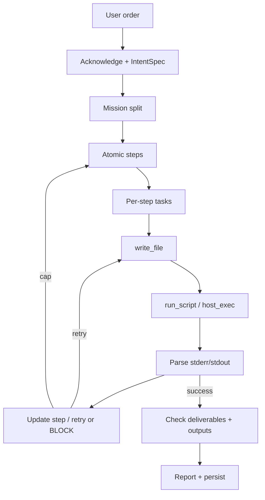

# Micro-Core Architecture — Script Builder Agent

**Status:** PROPOSAL  
**Date:** 2026-06-10

---

## Flow overview



---

## Layer A — Order intake (acknowledge)

On every new request:

1. **Restate** goal, language, paths, inputs/outputs, constraints
2. **Ask** only if `needs_clarification` (ambiguous path, missing runner env, destructive ops)
3. **Persist** `intent_spec.json` + `plan_state.json`
4. Inject `### DECLARED INTENT ###` every turn (Pulse Phase 6, partially shipped)

This satisfies "understands and ensures acknowledging orders."

---

## Layer B — Mission → atomic plan

Split the order into **missions** (coarse) then **atomic steps** (machine-tracked).

**Example order:** "Build a Python watcher for `C:\logs` and a PS1 installer that registers it as a scheduled task."

| Mission | Atomic steps |
|---------|----------------|
| M1: Python watcher | spec → write `watcher/watcher.py` → `run_script` smoke test → fix → verify imports |
| M2: PS1 installer | write `install_task.ps1` → syntax check → dry-run → run → verify task exists |

Each step gets: `id`, `label`, `tool_hint`, `success_criteria`, `assigned_agent` (optional).

### Default scripting plan template

Replace the thin regex fallback (`write_file` only) with:

| Step id | Label | Tool hint |
|---------|-------|-----------|
| `ack_requirements` | Restate order and confirm deliverables | — |
| `scaffold` | Write initial script at deliverable path | `write_file` |
| `run` | Execute with correct runner | `run_script` \| `host_exec` |
| `fix_loop` | Read errors, patch, rerun until exit 0 | `read_file`, `write_file`, runner |
| `verify` | Check output artifacts and success criteria | `read_file`, `grep_file` |
| `report` | Summarize what was built and how to run it | `append_note` |

---

## Layer C — Tasks within a step

Within "fix until works," decompose into **tasks** the model executes one tool at a time:

- T1: `read_file` script
- T2: `write_file` patched version
- T3: `host_exec` rerun
- T4: `read_file` output log

Pulse's LEAD rule — "one delegate per turn" — maps to **one tool per ReAct step** for reliability with small models.

---

## Layer D — Build / test / iterate loop

Reuse Pulse's executor (`core/task_plan.py`, `agent.py` error feedback):

```python
# Conceptual loop per atomic step
while step.status not in (DONE, BLOCKED):
    result = execute_tool(current_tool_hint)
    if result.exit_code == 0 and deliverable_ok():
        step.status = DONE
        break
    info = register_failure_attempt(step.id, result.stderr)
    inject_verbatim_error(info)
    if info.cap_reached:
        step.status = BLOCKED
        inject_strategy_change()
        break
```

Scripting-specific strategy changes at cap:

- Rewrite from scratch (not patch)
- Split script into functions + main guard
- Switch runner (`host_exec` flags, `-NoProfile`, `-ExecutionPolicy Bypass`)
- For Python: `pip install` then rerun

---

## Minimal tool surface (PowerShell + Python only)

| Tool | Role |
|------|------|
| `write_file` | Create/overwrite `.py` / `.ps1` |
| `read_file` | Inspect script + output files |
| `grep_file` | Assert output content |
| `run_script` | `.py` via venv |
| `host_exec` | `.ps1`, pip, one-liners |
| `append_note` | Plan/progress only (`workspace/plan.md`) |
| `sequentialthinking` | Optional, max 1 before acting |

**Exclude:** recon, web auth, PCAP, hash, `delegate_to` (unless two-agent LEAD+coder split is desired).

Optional hardening tools:

- `verify_script` — parse-only check (`python -m py_compile`, `pwsh -NoProfile -Command "& { . .\script.ps1 }"`)
- `assert_output` — regex/count checks on log files (deterministic, not LLM-judged)

---

## Completion criteria (criteria-based, not vibe-based)

Pulse's pending Phase 6 — generic completion on `success_criteria` — is what a script micro agent needs:

| Criterion type | Check |
|----------------|-------|
| File exists | `Path(deliverable).is_file()` |
| Ran clean | last `run_script`/`host_exec` exit 0 |
| Output artifact | `grep_file` or size/mtime |
| Behavior | optional pytest subprocess or golden output diff |

Never end on "I've created the script" without disk + run proof.

---

## Orchestration model

| Approach | Pros | Cons |
|----------|------|------|
| **Single agent** | Simpler, no handoff bugs, lower context | Less separation of plan vs code |
| **LEAD + coder** | Mirrors human PM/dev split | Stall risk, badge/orphan state, 2× context |

**Recommendation:** start **single-agent** with structured plan in `CURRENT STATE`. Add LEAD only if plan-quality vs code-quality conflicts appear.

---

## Config sketch

```yaml
agent:
  domain: scripting_only
  max_steps: 30
  max_step_attempts: 8
  tools: [write_file, read_file, grep_file, run_script, host_exec, append_note]
  prompt_pack: minimal_builder  # no AGENTS roster, no recon playbooks
  completion:
    require_deliverable_on_disk: true
    require_successful_run: true
  llm_audit: meta
```

---

## Pulse modules to fork or reuse

| Module | Reuse strategy |
|--------|----------------|
| `core/intent_spec.py` | Extend with `scripting` plan seed; drop non-dev domains |
| `core/task_plan.py` | Add `_SCRIPTING_PLAN` template; keep retry cap + gating |
| `core/task_intent.py` | Keep deliverable extraction as-is |
| `core/write_guard.py` | Keep as-is |
| `core/parser.py` | Keep code-block → `write_file` path |
| `tools_legacy.py` | Keep PS sanitizer + `run_script`/`host_exec` |
| `agent.py` | Strip to minimal ReAct loop + error feedback |
| `tools_dev/validate_mission.py` | Template for golden missions |
