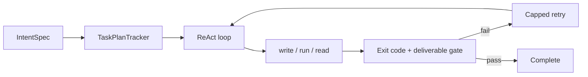

# Script-Builder Micro Agent — Design Brief

**Status:** PROPOSAL  
**Date:** 2026-06-10  
**Author:** distilled from Pulse agent review + live validation evidence

---

## Purpose

Design a **micro agent** that:

1. **Understands and acknowledges** user orders (formal intent, restated requirements)
2. **Splits** work into atomic plans or missions, then tasks per step
3. **Builds** PowerShell (`.ps1`) and Python (`.py`) scripts only
4. **Tests** them with the correct runner, **iterates** on failures, and completes only with proof on disk

This document synthesizes lessons from the Pulse agent (`pwsh_agent`). Detailed breakdowns live in sibling files under `docs/plans/micro-core/`.

---

## Problem statement

General-purpose agents (including Pulse before generalization) suffer from:

- **Domain bleed** — unrelated tasks routed to the agent's "one trick" (PCAP/hash pipeline)
- **Thin dev planning** — scripting requests get a single `write_file` step, no fix loop
- **False completion** — model claims success without deliverables on disk
- **Wrong runners** — `.py` via PowerShell, `.ps1` via `run_script`
- **Context bloat** — full specialist roster + recon playbooks for a simple script task

A micro agent fixes this by **narrow scope** + **strict structure**, not by adding more tools.

---

## Design principles

1. **Intent first** — every order becomes a persisted `IntentSpec` before any tool runs
2. **Atomic steps** — machine-tracked plan with statuses and success criteria per step
3. **One tool per turn** — reliable execution with small local models
4. **Verbatim errors** — stderr fed back deduped; capped retries with strategy change at 8
5. **Exit-code gating** — step done only on `exit_code == 0` (and deliverable checks)
6. **Minimal context** — scripting conventions + current step + last error, nothing else
7. **Proof-based completion** — file exists, ran clean, outputs verified

---

## User journey

```text
User: "Write ping_sweep.ps1 in workspace that pings 192.168.1.1–5
       and logs active hosts to workspace/ping_results.log, then run it."

Agent:
  1. ACK  — restate deliverables, runners, success criteria; persist IntentSpec
  2. PLAN — missions: [M1: write script, M2: run and fix, M3: verify output]
  3. BUILD — write_file(workspace/ping_sweep.ps1)
  4. TEST  — host_exec(script)
  5. ITERATE — on PS parse error: read_file → write_file fix → host_exec (≤8 attempts)
  6. VERIFY — read_file/grep_file ping_results.log
  7. DONE  — report with paths and how to rerun
```

Validated live on Pulse (session `20260610_015608`): converged in 2 fix iterations after `@echo off` batch/PS confusion.

---

## Architecture summary

See [architecture.md](./architecture.md) for full detail.

| Layer | Responsibility |
|-------|----------------|
| A — Intake | Acknowledge, clarify, persist `IntentSpec` |
| B — Planning | Mission split → atomic steps with tool hints |
| C — Tasks | One-tool ReAct steps within each atomic step |
| D — Executor | Build → run → observe → adapt (capped retries) |
| E — Completion | Deliverable + exit code + output verification |



---

## Lessons from Pulse

See [lessons_from_pulse.md](./lessons_from_pulse.md).

**Reuse:** IntentSpec, TaskPlanTracker, WriteGuard, retry executor, runner routing, golden missions, minimal specialist prompt pattern.

**Avoid:** Domain bleed, regex-only dev plans, premature handoff, 12-step chat cap for fix loops, loading full AGENTS/SOUL/recon context.

---

## Tool surface

PowerShell + Python only:

- `write_file`, `read_file`, `grep_file`
- `run_script` (`.py` + venv)
- `host_exec` (`.ps1`, pip, one-liners)
- `append_note` (plan progress only)
- `sequentialthinking` (optional, max 1)

No recon, web, PCAP, hash, or delegate handoff in v1.

---

## Completion contract

A mission is complete when **all** of:

- [ ] Every listed deliverable exists on disk at the path the user named
- [ ] Each script was executed at least once with exit code 0
- [ ] Optional output artifacts pass content checks (`grep_file` / golden diff)
- [ ] Agent report includes paths and rerun instructions

Never complete on natural-language claims alone.

---

## Testing

See [testing_strategy.md](./testing_strategy.md).

- Unit: plan template, retry cap, sanitizer, deliverable guards
- Golden intents: ~20 prompts → correct domain and deliverables
- Live missions: `validate_mission.py`-style harness
- Telemetry: `ctx_saturation`, attempts, time-to-green

---

## Implementation phasing

| Phase | Deliverable | Risk |
|-------|-------------|------|
| **0** | Document + golden mission prompts (this folder) | — |
| **1** | `scripting` plan template in `TaskPlanTracker` | Low |
| **2** | Minimal prompt pack + tool filter (scripting only) | Low |
| **3** | Completion evaluator keyed on `success_criteria` | Medium |
| **4** | Standalone micro agent entry point or mode flag | Medium |
| **5** | Golden mission CI + live Ollama validation | Low |

Phases 1–3 can ship inside Pulse as a `agent.mode: script_builder` before a full fork.

---

## Config sketch

```yaml
agent:
  mode: script_builder   # or standalone micro-core package
  domain: scripting_only
  max_steps: 30
  max_step_attempts: 8
  tools: [write_file, read_file, grep_file, run_script, host_exec, append_note]
  prompt_pack: minimal_builder
  completion:
    require_deliverable_on_disk: true
    require_successful_run: true
  llm_audit: meta
```

---

## Summary

Pulse already validated the core loop for a script-building micro agent:

**IntentSpec → atomic plan → one-tool ReAct → verbatim errors → capped retries → exit-code-gated completion → golden live missions**

The micro agent should be **smaller in tools and prompts** but **stricter in structure** than the full Pulse agent — essentially Phases 1–3 and 6 of the generalization design, with a fixed `scripting` plan template and no forensic/recon escape hatches.

---

## Document index

| File | Contents |
|------|----------|
| [README.md](./README.md) | Folder index and code references |
| [lessons_from_pulse.md](./lessons_from_pulse.md) | Achievements and pitfalls |
| [architecture.md](./architecture.md) | Layers, tools, orchestration, config |
| [testing_strategy.md](./testing_strategy.md) | Unit, golden, live missions |
| [script_builder_design_brief.md](./script_builder_design_brief.md) | This synthesis document |
