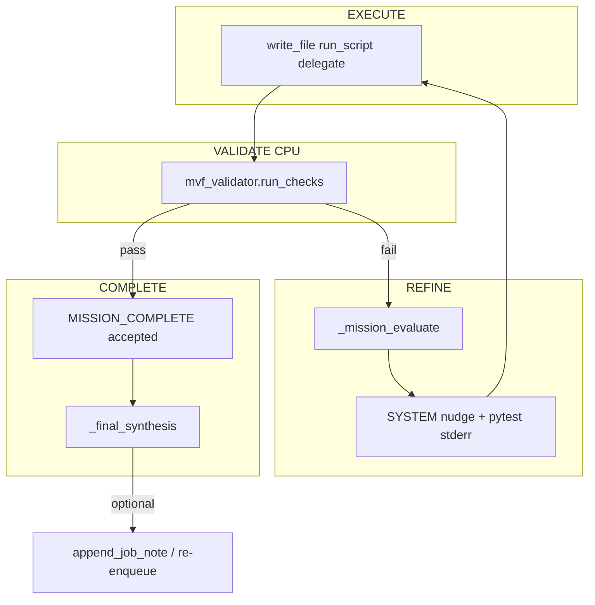

# Plan: Bucle probe / test / refine (R7)

> **Status:** PROPOSED  
> **Roadmap:** R7  
> **Prioridad:** P1  
> **Roadmap maestro:** [MVF_AGENCY_ROADMAP.md](./MVF_AGENCY_ROADMAP.md)  
> **Canon:** [AGENT_CANON.md](../AGENT_CANON.md) §4 (`refine`, `validate`), §9  
> **Depende de:** [mvf_validator_plan.md](./mvf_validator_plan.md), [loop_restrictions_review.md](./loop_restrictions_review.md)  
> **Desbloquea:** [hello_game_e2e_plan.md](./hello_game_e2e_plan.md) (recomendado), cierre loop R+P+A+V+I  
> **Opcional Q4:** [pulse_queue_agency_plan.md](./pulse_queue_agency_plan.md) para `append_job_note`

---

## Problema

Cuando EXECUTE produce artefactos pero MVF falla (pytest rojo, archivo faltante), el agente puede:

- Declarar `MISSION_COMPLETE` (pre-R4) o quedar en loop sin dirección clara (post-R4)
- No inyectar stderr de pytest en contexto de forma sistemática
- No reconectar introspección (EVALUATE) con la siguiente acción
- No re-encolar trabajo en Pulse Queue para intento posterior

R7 cierra el loop **Probe → fail → Refine → Re-execute** hasta MVF verde o límite de intentos.

---

## Objetivo

Cablear fallos MVF a EVALUATE + nudges + re-ejecución; enriquecer síntesis final; opcionalmente mutar cola con notas y re-encolado.

---

## Flujo objetivo



---

## Cambios planificados

### 1. Contador de intentos refine

En `agent.py` `run_mission`:

```python
self._mvf_refine_attempts = 0
MAX_MVF_REFINE = int(self.config.get("mvf", {}).get("max_refine_attempts", 5))
```

Incrementar en cada MVF fail que rechace `MISSION_COMPLETE`.

Si `>= MAX_MVF_REFINE`:

- Nudge final con resumen de fallos
- Opcional: `mark_job_failed` vía queue hook
- Salir con síntesis parcial (no complete)

### 2. Hook post-batch — probe temprano

En `_maybe_evaluate_after_batch` (`agent.py`):

```python
if load_mvf(self.session_id):
    result = validate_session(self.session_id, persist=True)
    if not result.validated:
        stderr = _extract_command_failures(result)
        await self._mission_evaluate(
            context=f"MVF probe failed: {stderr}",
            ...
        )
        self._add_nudge(f"[SYSTEM] MVF probe failed. Fix and re-run tests.\n{stderr}")
```

**Probe temprano:** ejecutar MVF checks tras batches que incluyan `write_file` o `run_script` (no cada turn).

Config:

```yaml
mvf:
  probe_after_tools: [write_file, run_script, host_exec]
```

### 3. Inyección de evidencia de fallo

Helper `_format_mvf_failure_for_context(result: MvfResult) -> str`:

- Lista checks fallidos
- Tail de stderr para `command` checks (últimos 1500 chars)
- Paths faltantes para `file_exists`

Añadir como mensaje `user` o `system` en `ctx_manager` antes del siguiente turn EXECUTE.

### 4. EVALUATE acoplado a fallo de test

Preferir `IntentPlanner.evaluate` con prompt:

```text
MVF validation failed. Roadmap step status attached.
Failed checks: ...
Recommend ONE next tool action to fix.
```

Fallback: `MissionEvaluator` con mismo contexto.

### 5. Introspección — `_final_synthesis()`

Extender síntesis final para incluir:

- Resumen IntentSpec goal vs logros
- Estado MVF (`validated`, checks pasados)
- Delta deliverables (esperado vs en disco)
- Enlace a `session_id` y job id si cola activa

### 6. Reconexión con cola (opcional v1)

Si `agent._active_queue_job_id` presente ([mvf_autonomous_plan.md](./mvf_autonomous_plan.md)):

```python
from core.work_queue import append_job_note, mark_job_failed

append_job_note(job_id, f"MVF refine attempt {n}: {summary}", source="agent")
if attempts >= MAX:
    mark_job_failed(job_id, f"MVF exhausted after {n} attempts")
```

Requiere [pulse_queue_agency_plan.md](./pulse_queue_agency_plan.md) para `append_job_note`.

**Re-encolado v2:** `enqueue_subtask` con payload refinado (`mission_text` += "Fix pytest failures: ...").

### 7. Relación con guards

Implementar **junto** con [loop_restrictions_review.md](./loop_restrictions_review.md):

- Con MVF activo, `MIN_TOOLS_*` relajados para code_build
- Sin MVF, mantener heurísticas legacy

---

## Configuración

```yaml
mvf:
  enabled: true
  max_refine_attempts: 5
  probe_after_tools:
    - write_file
    - run_script
  early_probe: true
```

---

## Tests planificados

| Test | Archivo |
|------|---------|
| MVF fail increments refine counter | `tests/test_mvf_refine_loop.py` |
| Post-batch probe triggers nudge | mismo |
| Max attempts → job failed note | mock work_queue |
| Synthesis includes mvf summary | mock run_mission end |

---

## Criterios de aceptación

1. HelloGame con test roto → agente recibe stderr pytest y continúa (no complete).
2. Tras fix + pytest verde → `MISSION_COMPLETE` aceptado.
3. Tras 5 fallos MVF → misión termina con error claro; job `last_error` poblado.
4. `_final_synthesis` menciona MVF status.
5. EVALUATE invocado al menos una vez en path de fallo MVF.

---

## Instrucciones de implementación

1. Completar R4 (`mvf_validator`) primero.
2. Añadir contador + hook post-batch en `agent.py`.
3. Implementar formateo de fallos + nudge.
4. Extender `_final_synthesis`.
5. Wire `append_job_note` cuando exista API de cola.
6. Test con proyecto pytest mínimo en tmp_path (sin LLM).

---

## Observaciones

1. **No duplicar pytest** — cache result en `mvf.json` `last_results` con timestamp; re-run si mtime de archivos cambió.
2. **Coste GPU** — EVALUATE en cada fail cuesta planner; limitar a 1 evaluate por refine attempt.
3. **Optioneer** no requerido; refine usa PLAN/EVALUATE existente.
4. Loop R+P+A+V+I completo requiere también cola mutável para re-encolar entre sesiones.

---

## Referencias

- [mvf_validator_plan.md](./mvf_validator_plan.md)
- [pulse_queue_agency_plan.md](./pulse_queue_agency_plan.md)
- [hello_game_e2e_plan.md](./hello_game_e2e_plan.md)
- [agency_audit_plan.md](./agency_audit_plan.md) — checklist V + I
