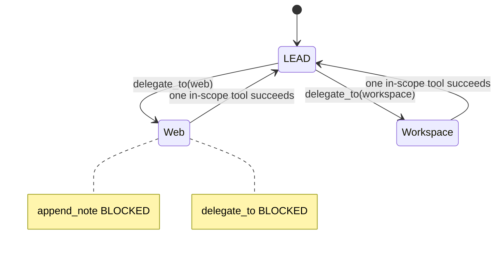

# Plan: Specialist handoff & prompt pack (implemented)

Status: **DONE** — 2026-06-04. See [session_closure_20260604.md](./session_closure_20260604.md) for verification.

## Architecture (current)



## Components

| Layer | Module | Responsibility |
|-------|--------|------------------|
| Registry | `core/specialists.py` | 6 agents, `LEAD_ONLY_TOOLS`, `delegate_to` |
| Schemas | `core/tool_schemas.py` | All registry tools in Ollama API |
| Prompt | `core/prompt_pack.py` | AGENTS + SOUL + TOOLS per active agent |
| Injection | `core/context_router.py` | CURRENT STATE + RELATED TOOL SCHEMAS |
| State | `core/working_state.py` | `build_current_state()` each turn |
| Loop | `agent.py` | Execute, handoff, nudge, bootstrap, orphan reset |
| Console | `console.py` | `session list/pick/clear`, `(LEAD)` badge |

## Handoff rules (enforced in code)

1. Only **LEAD** may call `delegate_to`.
2. Specialists **cannot** call `append_note`, `delegate_to`, findings/report tools.
3. Handoff completes after **one successful in-scope** specialist tool.
4. Incomplete handoff → reset to LEAD at chat turn end (`_reset_orphan_specialist`).
5. After `delegate_to`, ephemeral nudge tells specialist which tool to run.
6. After 2+ blocked LEAD-only attempts → deterministic bootstrap (`http_get` before login).

## Config (`config.yaml`)

```yaml
agent:
  prompt_pack_mode: true
  specialist_soft_scope: true   # LEAD may run wrong-scope tools with advisory
  session_fence_mode: true
  prompt_budgets:
    agents_tokens: 1000
    soul_tokens: 500
    tools_tokens: 1000
    current_state_tokens: 1500
```

## Tests

- `tests/test_tool_schemas.py`
- `tests/test_specialist_handoff.py`
- `tests/test_delegate_to.py`
- `tests/test_orphan_specialist.py`
- `tests/test_soft_scope.py`
- `tests/test_specialist_registry.py`

## Known limitations

- 7B model may still ignore nudges; bootstrap is the safety net.
- Soft scope on LEAD allows LEAD to call `http_get` directly (messy but allowed).
- `CURRENT_STATE.md` on disk can lag one turn; LLM uses live `build_current_state()`.
