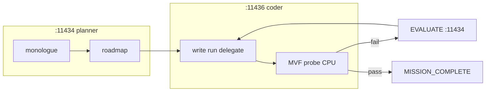

# Plan: Bucle de herramientas, parser y sequential thinking (T1)

> **Status:** PROPOSED  
> **ID:** T1 (tooling / agencia EXECUTE)  
> **Prioridad:** P1 — paralelo a R4/R7; sinergia con [gpu_allocation_plan.md](./gpu_allocation_plan.md)  
> **Roadmap maestro:** [MVF_AGENCY_ROADMAP.md](./MVF_AGENCY_ROADMAP.md)  
> **Relacionado:** [loop_restrictions_review.md](./loop_restrictions_review.md) §3, §D

---

## Problema

El agente tiene `SequentialThinkingEngine` capaz (ramas, revisiones, `needsMoreThoughts`) pero el **runtime lo aísla** del resto de herramientas:

1. **Parser** [`core/parser.py`](../../core/parser.py) `_pick_best_tool_calls`: máximo **1 acción** por turno; `sequentialthinking` prioridad 50 → descartado si hay otra tool.
2. **Prompt** [`agent.py`](../../agent.py): *"one sequentialthinking max"*, *"ONE ACTION tool call per turn"*.
3. **Guards** [`core/chat_goals.py`](../../core/chat_goals.py), [`core/mission_progress.py`](../../core/mission_progress.py): bloquean cadenas largas de thinking sin progreso.
4. **`delegate_to`**: `_stop_tool_batch = True` — corta batch tras delegación.
5. **Specialist handoff**: 1 tool in-scope → vuelta a LEAD.

**Síntoma observado (daemon 2026-06-19):** `Thought 5/3`, `Thought 6/3` — el modelo sigue pensando pero no encadena pensamiento → `read_file` → acción en el mismo ciclo; cada tool ≈ nueva llamada LLM (~45s).

Un Modelfile `tool_agent` **no resuelve** el límite de 1 acción/turno en parser.

---

## Objetivo

Definir evolución del bucle **pensar → actuar → verificar** sin romper seguridad (WriteGuard, SANDBOX, handoffs), alineado con:

- PLAN/EVALUATE en GPU planner (razonamiento estratégico ya externalizado)
- R4/R7 MVF (verdad = pytest, no más thinking vacío)
- [gpu_allocation_plan.md](./gpu_allocation_plan.md) (modelo EXECUTE optimizado)

---

## Estado actual (referencia código)

| Componente | Comportamiento |
|------------|----------------|
| `_pick_best_tool_calls` | `append_note`×N + **1** acción; ST prioridad baja |
| `process_llm_output` / `discover_tool_calls` | siempre `limit=1` acción |
| `SequentialThinkingEngine` | local Python; no LLM; budget `max_thoughts` |
| `RetryOrchestrator.parser_reflection` | salvage JSON → o synthetic ST |
| Pipeline PLAN | `IntentPlanner.monologue` en :11434 — **pensamiento real off-tool** |

---

## Propuestas de decisión

### Decisión T1-A — **Reducir dependencia de `sequentialthinking` en EXECUTE** (recomendada)

Confiar en PLAN (`vibethinker` monologue + roadmap) para estrategia; EXECUTE solo tools sustantivas.

| Acción | Detalle |
|--------|---------|
| Prompt LEAD | "Do not call sequentialthinking during EXECUTE unless stall recovery" |
| `code_build` | ST opcional off; bootstrap + MVF guían |
| Mantener ST | Misiones PCAP/hash/recon (playbook existente) |

| Esfuerzo | Bajo (prompt + chat_goals) |
| Riesgo | Bajo |
| Sinergia | R7, Optioneer (R3) |

**Estado:** ☐ Recomendada como default tras validar PLAN en HelloGame

---

### Decisión T1-B — **Parser: `thinking + action` en mismo turno (code_build)**

Extender `_pick_best_tool_calls` con modo `mission_kind`:

```text
Si mission_kind in (code_build, dev):
  Si última ST tiene nextThoughtNeeded: false
  → permitir [sequentialthinking, write_file|run_script|delegate_to]
  (máx 2 acciones: 1 ST + 1 sustantiva)
```

| Esfuerzo | Medio |
| Riesgo | Medio — más tokens, batch más largo |
| Test | `tests/test_parser_batch_notes.py` extender |

**Estado:** ☐ Tras audit G5 (¿modelo emite batch útil?)

---

### Decisión T1-C — **Modelfile `tool_agent` en GPU EXECUTE**

Ver [gpu_allocation_plan.md](./gpu_allocation_plan.md) Decisión C.

Mejora formato native `tool_calls`; **no** concurrencia ni thinking intercalado por sí solo.

**Estado:** ☐ Tras swap GPU + audit

---

### Decisión T1-D — **Relajar "ONE ACTION" → "one substantive action"**

Alineado con [loop_restrictions_review.md](./loop_restrictions_review.md) §D.

- Sustantivas: `write_file`, `run_script`, `delegate_to`, `read_file` (investigación), `host_exec`
- Meta: `append_note`, `sequentialthinking` no cuentan como la acción única

| Esfuerzo | Bajo |
| Riesgo | Bajo–medio (throughput ↑) |

**Estado:** ☐ Implementar con T1-B o solo prompt

---

### Decisión T1-E — **LEAD: `append_note` + `delegate_to` mismo turno**

Actualizar [`state/AGENTS.md`](../../state/AGENTS.md) y validación batch en parser.

| Esfuerzo | Bajo |
| Riesgo | Bajo |

**Estado:** ☐ Independiente

---

### Decisión T1-F — **Concurrencia real de tools**

Paralelizar `write_file` + `read_file` o múltiples subagents.

| Esfuerzo | Alto |
| Riesgo | Alto (SQLite session, WriteGuard, orden causal) |
| Roadmap | R9 + Q4 |

**Estado:** ☐ **Diferido** — no bloquea HelloGame MVF

---

### Decisión T1-G — **No hacer: ST como sustituto de PLAN**

No mover cadenas largas de `sequentialthinking` al bucle EXECUTE cuando PLAN ya produjo roadmap — duplica coste GPU coder.

---

## Flujo objetivo (T1-A + R7 + PLAN)



`sequentialthinking` reservado para dominios sin roadmap fuerte (audit, PCAP).

---

## Investigación abierta

| ID | Pregunta | Método | Bloquea |
|----|----------|--------|---------|
| **T-G1** | ¿El LLM emite múltiples tool_calls nativos que el parser descarta? | Contar raw `tool_calls` vs picked en `llm_audit` | T1-B, T1-C |
| **T-G2** | ¿% de turns EXECUTE son solo ST sin acción? | Script sobre audit / mission logs | T1-A prioridad |
| **T-G3** | ¿`read_file` debería ser "sustantiva" para code_build probe? | Caso HelloGame: leer antes de write | T1-D |
| **T-G4** | ¿ST + action mismo turn aumenta éxito MVF o solo tokens? | A/B HelloGame con/sin T1-B | T1-B go/no-go |
| **T-G5** | ¿Reflection salvage basta sin ST synthetic? | Tasa salvage vs ST injection | RetryOrchestrator |
| **T-G6** | ¿tool_agent reduce turns-to-MVF vs coder stock? | Benchmark 3 misiones | Decisión C |

---

## Integración con planes existentes

| Plan | Cambio |
|------|--------|
| [loop_restrictions_review.md](./loop_restrictions_review.md) | §3 ST, §D tool-per-turn — implementar vía T1-D/B |
| [probe_test_refine_plan.md](./probe_test_refine_plan.md) | Probe CPU reemplaza ST para "¿pytest verde?" |
| [agency_audit_plan.md](./agency_audit_plan.md) | Métrica: turns con solo ST |
| [gpu_allocation_plan.md](./gpu_allocation_plan.md) | Modelo en slot EXECUTE |
| [implementation_plan.md](./implementation_plan.md) | Ya prevé batch notes + 1 action — extender T1-B |

---

## Criterios de aceptación

1. HelloGame E2E: ≤50% turns EXECUTE sin tool sustantiva (post T1-A).
2. Si T1-B activo: al menos un turno con ST+`write_file` ejecutados en batch en test.
3. Audit documenta raw vs picked tool count (herramienta o log field).
4. No regresión en misiones PCAP/hash (ST sigue disponible).
5. Documentación `sequentialthinking.md` actualizada con "prefer PLAN over ST in code_build".

---

## Orden sugerido de trabajo

```text
1. Audit T-G1/T-G2 (llm_audit de sesión daemon existente)
2. gpu_allocation_plan Decisión A (swap 1070)
3. T1-A prompt/guards (paralelo)
4. gpu Decisión C tool_agent si T-G1 muestra salvage alto
5. T1-B/D si T-G4 positivo
6. T1-E independiente cuando convenga
— T1-F / concurrencia → R9
```

---

## Referencias

- [core/parser.py](../../core/parser.py) `_pick_best_tool_calls`
- [knowledge/tools/sequentialthinking.md](../../knowledge/tools/sequentialthinking.md)
- [state/MEMORY.md](../../state/MEMORY.md) — parser_reflection vs ST
- [Generalization/multi_purpose_agent_design.md](./Generalization/multi_purpose_agent_design.md) — advisory gates
