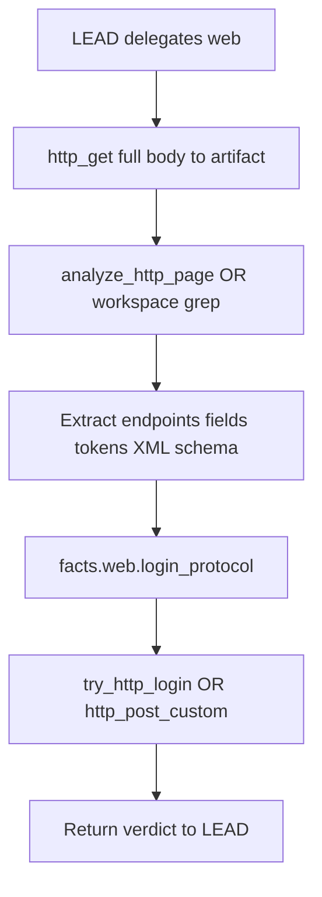

# Plan: Web auth HTML/XML pipeline (PCAP parity)

Status: **PLANNED** — not implemented. Created 2026-06-04 after ZTE router (`192.168.1.1`) login attempts.

## Problem statement

The **forensic/PCAP** path discovers protocols (forms, credentials, XML tokens) via `analyze_pcapng` → facts → `grep_file`. The **web** path assumes simple HTML forms and stops at blind `try_http_login`. ZTE and similar CPEs use large JS/XML login flows that do not fit generic `username`/`password` POST.

## Current gaps

| Capability | PCAP (forensic) | Web auth (today) |
|------------|-----------------|------------------|
| Structured extract | `analyze_pcapng` → `http_forms`, `key_fields` | None |
| Facts persistence | `pcap.http_forms_preview`, keywords | `facts.web` only stores header/TLS targets |
| Full payload on disk | Verbose log + artifact spill | `http_get` truncates at 20k chars **before** spill |
| Deep search | `grep_file` / `find_and_grep` with guided patterns | `grep_file` is **workspace**, not web |
| Multi-step auth | Observed in traffic | Not supported (no token/XML handshake) |
| Login attempt | N/A | Basic + dumb form POST only |

## Target flow

## Phase 1 — Fetch and persist (minimal)

**Goal:** Never lose the full HTML before analysis.

1. **`http_get` changes**
   - Write full body to `state/sessions/<id>/artifacts/http_get_*.html` unconditionally (or lower spill threshold for content field).
   - Return pointer + `truncated: true` + first N chars preview in tool result.
   - Optional param: `save_full=true` (default true for `web_auth` domain).

2. **`facts_store`**
   - On successful `http_get`: set `facts.web.url`, `facts.web.artifact_path`, `facts.web.content_length`, keyword scan (`login`, `xmlobj`, `password`, `form`).

3. **Planner**
   - `web_auth` plan step 1: `http_get` (required before `attempt_login`).
   - Block `try_http_login` in bootstrap until `fetch_page` step done or artifact exists.

**Files:** `tools/recon.py`, `core/facts_store.py`, `core/task_plan.py`, `agent.py` bootstrap.

**Tests:** `tests/test_http_get_artifact.py`, extend `tests/test_facts_store.py`.

---

## Phase 2 — Parse login protocol

**Goal:** Discover how to POST, not guess field names.

**Option A — New tool `analyze_http_page` (web specialist)**

Input: artifact path or URL (re-fetch if needed).

Output (structured JSON):

- `forms[]`: action, method, field names
- `scripts[]`: URLs of login-related JS
- `xml_snippets[]`: lines matching `xmlobj`, `SessionToken`, etc.
- `suggested_post`: `{ url, content_type, body_template_hint }`

Implementation: PowerShell `Select-String` + regex heuristics; optional second pass on linked `.js` files via `http_get`.

**Option B — LEAD delegates workspace after web fetch**

- web: `http_get` only
- workspace: `grep_file` on artifact with patterns from `core/credential_extract.py` (reuse PCAP patterns)

Prefer **A** long-term; **B** as interim with documented playbook in `knowledge/tools/http_get.md`.

**Files:** `tools/recon.py` or `tools/web_auth.py`, `tools/__init__.py`, `core/specialists.py` (if web-owned).

---

## Phase 3 — Custom login POST

**Goal:** Support ZTE-style XML/form posts.

Extend `try_http_login` or add `http_post_login`:

| Param | Purpose |
|-------|---------|
| `method` | `basic`, `form`, `xml`, `raw` |
| `body` | Raw POST body (XML/json) |
| `content_type` | e.g. `application/xml`, `text/xml` |
| `headers` | Extra headers (Referer, Cookie from prior GET) |
| `username_field` / `password_field` | Form fields when known |

Cookie jar: persist `SID` from first GET for second POST (ZTE sets `SID` on `/`).

**Files:** `tools/recon.py` (`_try_http_login_script`), tests with mock HTTP server.

---

## Phase 4 — Optional PCAP fallback

For “how does login work?” when HTML is opaque:

1. LEAD delegates **forensic**: `capture_packets` during manual browser login.
2. Existing PCAP pipeline extracts real POST body and endpoint.
3. Feed extracted template into Phase 3.

Document in `state/AGENTS.md` routing: `web_auth` + “capture login traffic” → forensic then web.

---

## Phase 5 — Documentation and prompts

- `knowledge/tools/http_get.md` — always grep artifact before login
- `knowledge/tools/try_http_login.md` — when generic login fails, parse first
- `state/SOUL.md` — web_auth: parse before POST
- `core/task_plan.py` — three-step plan: fetch → analyze → login

---

## Success criteria

Operator prompt:

> Login to http://192.168.1.1 with user/password …

Expected agent behavior:

1. `delegate_to(web)` → `http_get` → full artifact on disk
2. Parse or grep finds login endpoint/fields (or documents “XML POST required”)
3. `try_http_login` / custom POST with correct shape
4. Verdict reported; no false `attempt_login` done without fetch evidence

---

## Non-goals (this plan)

- Browser automation (Selenium/Playwright)
- Breaking router security beyond operator-owned lab device
- Replacing forensic PCAP pipeline
