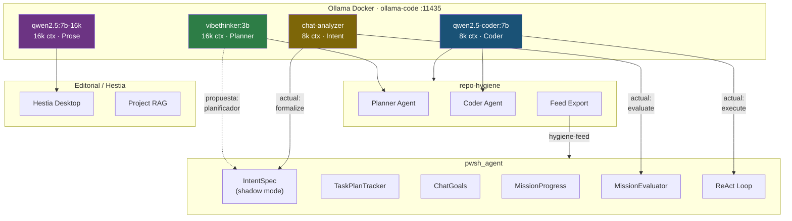

# Reconocimiento de Alineación del Ecosistema — Análisis Crítico

## 1. Infraestructura de Modelos Compartida

Todos los sistemas apuntan a `http://localhost:11435` (contenedor `ollama-code`), con un solo Docker Compose y un [registry.yaml](file:///c:/Users/soyko/Documents/Ollama/docker/models/registry.yaml) como fuente canónica de tags y contextos.

| Modelo | num_ctx | Rol actual | Consumidores |
|--------|---------|------------|--------------|
| `qwen2.5-coder:7b-instruct` | 8192 | Codificación, herramientas, análisis profundo | pwsh_agent, repo-hygiene coder |
| `vibethinker:3b` | 16384 | Planificación, routing, síntesis | repo-hygiene planner **solo** |
| `chat-analyzer` | 8192 | Formalización de intención, conversación corta | pwsh_agent conversacional |
| `qwen2.5:7b-16k` | 16384 | Prosa larga, narrativa | Editorial, Hestia |
| `qwen2.5:3b` | 8192 | Auxiliar ligero | Benchmarks pwsh_agent |

---

## 2. Estado Actual del pwsh_agent: Lo Que Ya Existe

> [!IMPORTANT]
> pwsh_agent **no es un sistema sin planificación**. Ya tiene capas que desempeñan partes del rol de "planificador", aunque todas corren en el **mismo modelo** (qwen2.5-coder:7b) o con heurísticas deterministas.

### 2.1 Capas existentes de planificación/supervisión

| Capa | Archivo | ¿Usa LLM? | Qué hace |
|------|---------|------------|----------|
| **IntentSpec** | [intent_spec.py](file:///c:/Users/soyko/Documents/Libraries/pwsh_agent/core/intent_spec.py) | Opcional (`chat-analyzer`) | Formaliza dominio, objetivos, targets, safety, capabilities. Shadow mode: se computa pero no gatilla routing todavía. |
| **TaskPlanTracker** | [task_plan.py](file:///c:/Users/soyko/Documents/Libraries/pwsh_agent/core/task_plan.py) | No | Roadmap de pasos atómicos con estados (PENDING→DONE→FAILED→BLOCKED), readaptación, trial-and-error cap (8 intentos). |
| **ChatGoals** | [chat_goals.py](file:///c:/Users/soyko/Documents/Libraries/pwsh_agent/core/chat_goals.py) | No | Goals registrados por regex: bloquean herramientas incorrectas, fuerzan secuencias, nudge text. |
| **MissionProgressTracker** | [mission_progress.py](file:///c:/Users/soyko/Documents/Libraries/pwsh_agent/core/mission_progress.py) | No | Anti-stall: detecta streaks no-sustantivos, objective_satisfied(), stall_directive(). |
| **MissionEvaluator** | [mission_evaluator.py](file:///c:/Users/soyko/Documents/Libraries/pwsh_agent/core/mission_evaluator.py) | Sí (`chat-analyzer`) | Evaluación JSON de progreso: status, next_tool, hint. Solo dispara para retrieval missions. |
| **DynamicContextBuilder** | [llm_utils.py](file:///c:/Users/soyko/Documents/Libraries/pwsh_agent/core/llm_utils.py#L414-L568) | No | Inyección de CURRENT PHASE basada en dominio/herramientas usadas. |
| **ContextRouter** | [context_router.py](file:///c:/Users/soyko/Documents/Libraries/pwsh_agent/core/context_router.py) | No | Compone todas las inyecciones: RAG, schemas, playbooks, session context. |

### 2.2 Lo que falta (gaps reales)

1. **IntentSpec en shadow mode**: Se computa y se persiste, pero **no gatilla** routing, planificación ni evaluación de completitud. Es la pieza obvia donde un planificador dedicado aportaría más.

2. **TaskPlanTracker es keyword-driven**: Los pasos se parsean por regex del prompt del usuario. No hay un LLM que descomponga tareas complejas o ambiguas en roadmaps adaptativos.

3. **MissionEvaluator es demasiado estrecho**: Solo dispara para misiones con keywords "retrieve/login/password/xmlobj/salt". Tareas de codificación general no tienen evaluación de progreso por LLM.

4. **No hay checkpoint de usuario**: El agente no pregunta nunca "¿seguimos intentando, añadimos info, o damos por terminado?" — solo hay caps mecánicos (MAX_STEP_ATTEMPTS=8, max_steps=30).

---

## 3. Evaluación Crítica: vibethinker:3b como Planificador en pwsh_agent

### 3.1 Lo que es objetivamente bueno de la propuesta

- **Precedente probado**: repo-hygiene ya usa el pipeline dual `vibethinker:3b` (planner) → `qwen2.5-coder:7b` (coder) con éxito. La infraestructura de VRAM y unload ya está validada.

- **Ventana de contexto 2x**: vibethinker tiene 16k tokens vs 8k del coder. Un planificador que ve más contexto puede descomponer mejor tareas ambiguas.

- **Ligero (3B)**: La latencia de una llamada de planificación es baja (~1-3s). No compite por VRAM con el coder 7B si se usa `unload_after_call`.

- **Superficie de integración clara**: El `IntentSpec` shadow mode ya hace el 80% del trabajo — solo falta cambiar `source: fallback` por una llamada LLM a vibethinker en lugar de a chat-analyzer, y activar el gating que hoy está deshabilitado.

### 3.2 Lo que merece escepticismo

> [!WARNING]
> **vibethinker:3b NO es un modelo de tool-calling**. Es un modelo de razonamiento/síntesis (Q4_K_M, derivado de Qwen2.5-3B con fine-tuning de pensamiento). Esto importa.

**Riesgo 1 — Hallucination en decomposición de tareas**

Un modelo 3B planificando tareas de código para un modelo 7B puede producir roadmaps incorrectos o over-engineered. En repo-hygiene esto funciona porque:
- Los prompts del planner son muy acotados ([review_planner.md](file:///c:/Users/soyko/Documents/repo-hygiene/agents/review_planner.md): clasificar, priorizar, consolidar).
- El planner no toma decisiones de herramientas — solo clasifica y sintetiza.
- El scope es fijo (archivos de un repo, no input arbitrario del usuario).

En pwsh_agent, el scope es **abierto**: el usuario puede pedir desde "crackea este hash" hasta "escríbeme un script de backup". Un 3B planificando esto puede ser más ruidoso que útil.

**Riesgo 2 — Latencia acumulada con unload**

Con `unload_after_call: true` (necesario para no duplicar VRAM), cada cambio de modelo requiere carga/descarga. En pwsh_agent interactivo, esto introduce ~5-8s extra **por turno** (load vibethinker → plan → unload → load qwen-coder → execute). En repo-hygiene esto es invisible porque es un daemon batch. En un chat interactivo, el usuario lo nota.

**Riesgo 3 — El chat-analyzer ya existe en el mismo nicho**

`chat-analyzer` (basado en qwen2.5:7b, 8k ctx) ya se usa para:
- `IntentFormalizer` (formalización de intención con LLM)
- `MissionEvaluator` (evaluación de progreso)

Introducir vibethinker como tercer modelo activo significa que un turno podría requerir **tres cargas de modelo**: vibethinker (plan) → qwen-coder (execute) → chat-analyzer (evaluate). Con una sola GPU y unload, esto es prohibitivo.

### 3.3 Veredicto

La idea es sólida en concepto pero **el beneficio marginal vs. la complejidad es dudoso si no se resuelve la pregunta de VRAM/latencia** y no se acota el rol del planificador.

---

## 4. Propuesta Concreta: Dos Caminos

### Opción A — vibethinker reemplaza chat-analyzer (menor complejidad)

Usar vibethinker:3b para **todo** lo que hoy hace chat-analyzer, y además asumir el rol de planificador:

```yaml
# config.yaml propuesto
ollama:
  default_model: "qwen2.5-coder:7b-instruct"
  conversational_model: "vibethinker:3b"   # reemplaza chat-analyzer
  synthesis_model: "vibethinker:3b"         # nuevo: planificación + evaluación
```

**Pros**: Solo dos modelos activos (no tres). vibethinker tiene 16k ctx vs 8k de chat-analyzer.
**Contras**: vibethinker podría ser peor en intent formalization JSON que chat-analyzer (7B vs 3B para salida estructurada).

### Opción B — vibethinker como planificador separado, sin chat-analyzer (máxima coherencia)

Consolidar los tres roles (intent, planning, evaluation) en vibethinker. Eliminar chat-analyzer de la ecuación.

```yaml
ollama:
  default_model: "qwen2.5-coder:7b-instruct"
  planner_model: "vibethinker:3b"          # nuevo campo
  conversational_model: null                # desactivado: vibethinker asume
```

**Pros**: Un solo modelo auxiliar. Máxima alineación con repo-hygiene.
**Contras**: Requiere validar que vibethinker genera JSON limpio para IntentSpec y MissionEvaluator.

---

## 5. El Checkpoint de Usuario — Diseño Independiente del Modelo

> [!TIP]
> La funcionalidad de "preguntar al usuario si seguir, añadir info, o terminar" **no depende del modelo planificador**. Es una decisión del loop ReAct que puede implementarse hoy mismo con el stack actual.

Puntos de inserción naturales:

| Trigger | Dónde | Lógica |
|---------|-------|--------|
| `TaskPlanTracker.needs_readaptation()` devuelve `True` | Tras un step `FAILED` | "El paso X falló. ¿Quieres que intente otra estrategia, me des más contexto, o lo marcamos como terminado?" |
| `MissionProgressTracker.needs_stall_recovery()` | 3+ herramientas no sustantivas seguidas | "Parece que estoy dando vueltas. ¿Continuamos, añades info, o cerramos?" |
| `StepStatus.BLOCKED` (attempt cap=8 alcanzado) | En `task_plan.py` | "He agotado 8 intentos en este paso. ¿Cambio de enfoque o lo dejamos?" |
| Cada N steps (configurable, e.g. 10) | Loop ReAct principal en `agent.py` | Checkpoint periódico genérico |

---

## 6. Preguntas Abiertas Para Ti

1. **¿Cuánta latencia extra es aceptable por turno?** Con unload, cada swap de modelo añade ~5-8s. ¿Es tolerable en un chat interactivo? ¿O prefieres que el planificador solo corra al inicio de la misión (no en cada turno)?

2. **¿Opción A o B?** ¿vibethinker reemplaza chat-analyzer (A) o eliminamos chat-analyzer por completo (B)? La A es más conservadora; la B es más limpia pero requiere benchmarks.

3. **¿El checkpoint de usuario es bloqueante o sugerencia?** Es decir: cuando el agente pregunta "¿seguimos?", ¿debe detenerse hasta que respondas? ¿O emite la pregunta y sigue intentando hasta que respondas (estilo async)?

4. **¿El planificador debería correr en cada turno o solo al inicio de misión/cambio de intención?** En repo-hygiene corre solo al inicio del pipeline. En pwsh_agent interactivo podrías querer que re-evalúe más a menudo, pero eso multiplica el costo.

---

## 7. Alineación del Ecosistema Completo (Resumen Actualizado)



> [!NOTE]
> La línea punteada (vibethinker → IntentSpec) es la propuesta. Las líneas sólidas son el estado actual verificado. La pregunta central es si vibethinker **reemplaza** chat-analyzer o **se suma** como tercer modelo activo (lo cual desaconsejo por VRAM).
